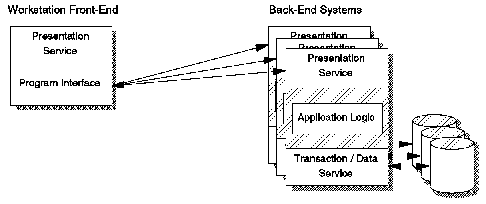

[Previous](1-1-3.md) | [Index](README.md) | [Next](1-1-3-2.md)

---

### 1\.1\.3\.1 Distributed Presentation

Distributed presentation implementations place some portions of the user interface on one node, and some of it on other nodes \([Figure 2](2.png)\)\. For instance, a workstation handles the user interactions with a mouse, keyboard, and screen, while another node contains some shared presentation functions\. The application components work together through a back\-end presentation interface\. X Windows, Easel, and OS/2 Presentation Manager are commonly used in developing applications of this sort, to leverage investments made in host systems and in programmable workstation technology\.

The VM/ESA Graphical User Interface Facility, described in ["Native CMS GUI](3-2-3-2.md) [Facility" in topic 3\.2\.3\.2](3-2-3-2.md), is an example of distributed presentation\.

*Figure 2\. Distributed Presentation Style*

---

[Previous](1-1-3.md) | [Index](README.md) | [Next](1-1-3-2.md)
