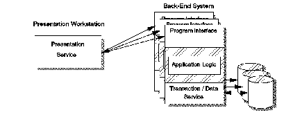

[Previous](1-1-3-1.md) | [Index](README.md) | [Next](1-1-3-3.md)

---

### 1\.1\.3\.2 Remote Presentation

An application is said to use remote presentation functions \(or services\) when the presentation part of the application is placed entirely on a single node, while the rest of the application is on another node \([Figure 3](3.png)\)\. The presentation service may be a distributed dialog manager that uses a GUI\. This situation may be useful in nonconversational applications, where all the end\-user interactions are predetermined\.

By having all the user activity completed together, a complete transaction record can be sent from the presentation node to the application node, and a single reply sent back\.

An example of remote presentation is a terminal that serves to collect a screen full of data, and pass it back to the rest of the application\.

*Figure 3\. Remote Presentation Style*

---

[Previous](1-1-3-1.md) | [Index](README.md) | [Next](1-1-3-3.md)
