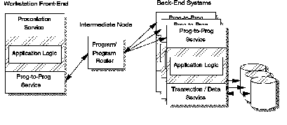

[Previous](1-1-3-2.md) | [Index](README.md) | [Next](1-1-3-4.md)

---

### 1\.1\.3\.3 Distributed Function

In an application using distributed functions, the application logic is split so that different parts run on different nodes \([Figure 4](4.png)\)\. Usually, the split is done on an initiation/completion basis\. The client initiates the interaction, and the server machine collects it, and reacts accordingly\.

This arrangement is particularly well suited to very interactive or I/O intensive applications\. The split, in this case, is usually made so that the application logic relating to the presentation functions is placed on the user node, and the code relating to database handling is executed in the server node\.

A significant constraint inherent with this style is that the stored data is still centralized on the back\-end system \(server node\)\.

*Figure 4\. Distributed Function Style*

---

[Previous](1-1-3-2.md) | [Index](README.md) | [Next](1-1-3-4.md)
