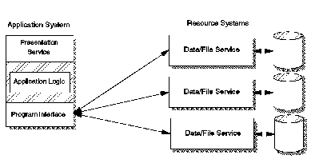

[Previous](1-1-3-3.md) | [Index](README.md) | [Next](1-1-3-5.md)

---

### 1\.1\.3\.4 Remote Data Management

Data management logically consists of two parts\. The first is the database processing \- where the actual accessing of the data occurs; and second is the data processing logic within the application \- deciding how to manipulate the data \([Figure 5](5.png)\)\. The database processing has to reside on the system where the DBMS exists, but no such requirement exists on the data processing logic\. The case where the DBMSs for a given application resides on a single system separate from the application node is called remote data management\. This style differs from the distributed function because there is no application logic in the back\-end system\. There are many database packages today that support remote data management, such as DB2/VM, Oracle, and Gupta\.

This style of processing is easy to implement; however, there are some drawbacks\. This environment requires significant interaction between the application and the data server in the form of data requests and responses, which may cause excessive communication overhead\. Keep in mind that requesting two records from a remote database for something you wish to calculate requires more overhead than making the calculation on the database system, then passing only the answer back \(as in distributed function\)\. Remote data management also tends to position databases on a single database server, and so can produce performance bottlenecks\.

Generally, remote data management implementations are most suitable where there are few, infrequent queries producing small amounts of data\.

*Figure 5\. Remote Data Management Style*

---

[Previous](1-1-3-3.md) | [Index](README.md) | [Next](1-1-3-5.md)
