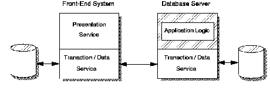

[Previous](1-1-3-4.md) | [Index](README.md) | [Next](1-1-3-6.md)

---

### 1\.1\.3\.5 Distributed Database

This style involves placement of data over several nodes \([Figure 6](6.png)\)\. The application, data, and DBMS can reside anywhere in the network; the data management functions are distributed between a front\-end system and the database server\.

It is possible in this environment to place edit\-checking function on the user node, where any validity checks accessing the local database can be performed, and permit remote completion requests for the main application database only after successful validation\. In this implementation, the network traffic can be reduced significantly over the remote data management environment because, with remote data style, there is no local database and all requests are sent to the database server\.

*Figure 6\. Distributed Database Style*

---

[Previous](1-1-3-4.md) | [Index](README.md) | [Next](1-1-3-6.md)
