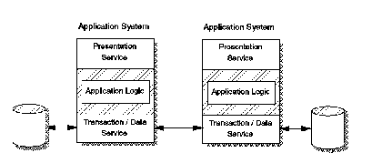

[Previous](1-1-3-5.md) | [Index](README.md) | [Next](1-1-3-7.md)

---

### 1\.1\.3\.6 Multiapplication

The multiapplication style is a combination of distributed function and distributed database styles \([Figure 7](7.png)\)\. The multiapplication style has application logic and data split apart and distributed in paired pieces\. The data is private to the application and is not directly accessible by applications on other nodes, but the applications are active at the same time and engage in simultaneous communication with each other\. Each application works as part of a team of applications to complete a given business task\.

Coordination requirements make these applications more difficult to design\. The need for data integrity requires that if one application fails to update its database, the other application's database updates must be undone to restore consistency between the two\. Such designs require a distributed transaction management service to maintain data base coordination\.

*Figure 7\. Multiapplication Style*

---

[Previous](1-1-3-5.md) | [Index](README.md) | [Next](1-1-3-7.md)
