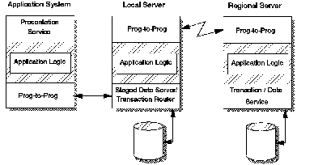

[Previous](1-1-3-6.md) | [Index](README.md) | [Next](1-1-4.md)

---

### 1\.1\.3\.7 Data Staging Style

Another combination of the basic styles is the data staging style \([Figure 8](8.png)\)\. With this style, the "true" data remains on a regional back\-end system\. These regional and local back\-end systems are often called regional and local servers\. Data staging still preserves the integrity and security of the "true" database by keeping it under the protection of a central back\-end system where it can be backed up and consistently recovered\.

Data staging maintains the availability of some operational data even if the regional server is not functioning\. Data staging can improve access time to the local server, reduce communications costs to the regional server and reduce load on the regional server\. On the other hand, data staging involves additional design complexity to devise the staging policies and additional operations complexity to stage the data snapshots periodically to the local servers\.

*Figure 8\. Data Staging Style*

---

[Previous](1-1-3-6.md) | [Index](README.md) | [Next](1-1-4.md)
