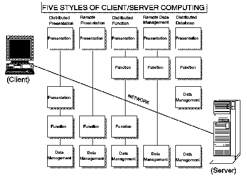

[Previous](1-1-2-2.md) | [Index](README.md) | [Next](1-1-3-1.md)

---

## 1\.1\.3 Implementing Client/Server

We've described, in reviewing the expectations of the marketplace, the far\-reaching requirements for Client/Server implementations\.

There are many views one could take on how to design solutions to meet these requirements\. A model that is often published is the Five Styles shown in [Figure 1](1.png)\.

*Figure 1\. Five Styles of Client/Server Computing*

Within each style, there is an application consisting of three major

layers, as shown in [Figure 1](1.png); a presentation layer, a function layer, and a data management layer\. Each layer, or parts of each layer, can be distributed between the client and the server as shown\.

The presentation layer is the logic of the application that interacts with the user's workstation\. It includes functions for managing the interaction between the user and the application, such as screen formatting, and keyboard and mouse handling\. The function or business processing layer is not concerned with either the end\-user interactions nor the database activity\. It includes such activities as performing calculations, data enrichment \(where data structures have information added from other data structures\), and any rules defined by the user that determine what particular processing should take place\. The data management layer in an application consists of both the code that requests the database change, such as SQL, and the database processing itself as performed by the Database Management System \(DBMS\), such as DB2/VM and VSE \(formerly SQL/DS\)\.

For use in the discussion of the Five Styles, the term node represents either the client or the server\. The client is typically associated with the end\-user's workstation, biased toward presentation\. The server can be the host system, providing data management and additional processing\.

These Five Styles are not intended to encapsulate everything regarding a Client/Server application\. It is more important to recognize that an application can be broken into smaller parts that may be executed in a multitude of ways to make best use of the resources available\.

What can be said, though, is that the five scenarios describe the basic processing styles that can be defined\. All applications would be some combination of these five basic styles\. For example, it would be possible to build an application that combined elements of both the distributed function style and the remote data management style\. The following sections discuss the basic styles and some of their possible combinations\.

Subtopics:

- [1\.1\.3\.1 Distributed Presentation](1-1-3-1.md)
- [1\.1\.3\.2 Remote Presentation](1-1-3-2.md)
- [1\.1\.3\.3 Distributed Function](1-1-3-3.md)
- [1\.1\.3\.4 Remote Data Management](1-1-3-4.md)
- [1\.1\.3\.5 Distributed Database](1-1-3-5.md)
- [1\.1\.3\.6 Multiapplication](1-1-3-6.md)
- [1\.1\.3\.7 Data Staging Style](1-1-3-7.md)

---

[Previous](1-1-2-2.md) | [Index](README.md) | [Next](1-1-3-1.md)
