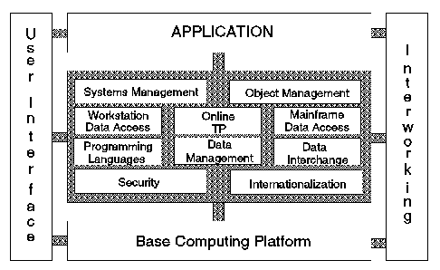

[Previous](2-2-2-1.md) | [Index](README.md) | [Next](2-2-3.md)

---

### 2\.2\.2\.2 X/Open Portability Guide

<a id="HDRHXOP102"></a>

**XPG3** The *X/Open Portability Guide* \(Issue 3\) defines X/Open's Common Application Environment \(CAE\)\. In the third issue of XPG \(XPG3\), the Base CAE is based on POSIX\.1 and the C language\. Components of CAE are categorized as base, extension, or optional\. Other languages included in CAE are Ada, FORTRAN, COBOL, and Pascal\. **XPG4** The *X/Open Portability Guide* \(Issue 4\) redefines X/Open's Common Application Environment \(CAE\)\. The fourth issue of XPG \(XPG4\), published in September 1992, is more granular; that is, products that implement any of the 22 individual languages and services can receive the X/Open approval for that element of XPG4\. The XPG4 Base is based on ANSI C, X/Open Common Usage C, and POSIX\.1 and \.2 extended for international usage\.

[Figure 9](9.png) shows the key areas that are covered in the XPG4 definition\. Each of these is broken down into further detail until at the lowest level there is some "standard" or specification that is required to provide the function\.

<a id="FIGXPG4DEF"></a>



*Figure 9\. XPG4 Definition*

[Table 1](<#TBLXPGCOMP>) lists the different components of XPG3 and XPG4\. For a product to have the XPG "brand," it must pass an array of conformance tests for a specific component\. The different brands awarded are XPG Base, XPG Plus, and XPG Component\. The Base brand consists of internationalized system calls and languages, commands and utilities, and the C language\. The Plus brand incorporates all the components\. When a product passes the necessary conformance tests, the vendor is not bound to maintain the compliance of that product\.

<a id="TBLXPGCOMP"></a>

```
    ______________________________________________________________________________
 | | Table 1. XPG Components                                                      |
   |________________________________________________________ __________ __________|
 | | Components                                             |   XPG3   |   XPG4   |
   |________________________________________________________|__________|__________|
 | | Internationalized System Calls and Libraries           |     X    |     X    |
   |________________________________________________________|__________|__________|
 | | C Language                                             |     X    |     X    |
   |________________________________________________________|__________|__________|
 | | COBOL Language                                         |     X    |     X    |
   |________________________________________________________|__________|__________|
 | | FORTRAN Language                                       |     X    |     X    |
   |________________________________________________________|__________|__________|
 | | ISAM                                                   |     X    |     X    |
   |________________________________________________________|__________|__________|
 | | Magnetic Media                                         |     X    |     X    |
   |________________________________________________________|__________|__________|
 | | Commands and Utilities                                 |     X    |     X    |
   |________________________________________________________|__________|__________|
 | | Pascal Language                                        |     X    |     X    |
   |________________________________________________________|__________|__________|
 | | Terminal Interfaces                                    |     X    |     X    |
   |________________________________________________________|__________|__________|
 | | Relational Databases                                   |     X    |     X    |
   |________________________________________________________|__________|__________|
 | | ADA Language                                           |     X    |     X    |
   |________________________________________________________|__________|__________|
 | | X Window System Application Interface                  |     X    |     X    |
   |________________________________________________________|__________|__________|
 | | Transport Service (XTI)                                |          |     X    |
   |________________________________________________________|__________|__________|
 | | BSFT                                                   |          |     X    |
   |________________________________________________________|__________|__________|
 | | X.400 Gateway                                          |          |     X    |
   |________________________________________________________|__________|__________|
 | | X.400 Message Access                                   |          |     X    |
   |________________________________________________________|__________|__________|
 | | Directory Access                                       |          |     X    |
   |________________________________________________________|__________|__________|
 | | Network Fike System (NFS)                              |          |     X    |
   |________________________________________________________|__________|__________|
 | | CPI-C                                                  |          |     X    |
   |________________________________________________________|__________|__________|
 | | (PC) NFS Server                                        |          |     X    |
   |________________________________________________________|__________|__________|
 | | LMX Server                                             |          |     X    |
   |________________________________________________________|__________|__________|
```

---

[Previous](2-2-2-1.md) | [Index](README.md) | [Next](2-2-3.md)
