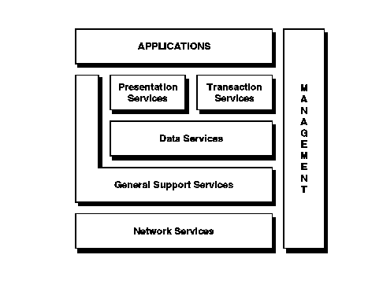

[Previous](2-3.md) | [Index](README.md) | [Next](2-3-2.md)

---

## 2\.3\.1 The Model Concept

Expressed in its simplest form, an open and distributed system contains the elements shown in [Figure 10](10.png)\. Although this model is high level, it introduces the key components of open distributed computing and begins to show the relationships between them\. Notice that there is no mention of any specific operating system, nor of any specific sets of standards\. The Open Blueprint is built upon this kind of model\.

*Figure 10\. Open Enterprise Model*

The model defines five distinct areas of distributed computing: presentation, transaction, data, general support, and networking\. Encompassing all of these areas is the management box, which covers systems management within an open environment\.

Many vendors and open organizations offer diagrams such as this to define their own interpretation of how an open enterprise should look\. IBM continually works internally and with bodies such as X/Open and OSF to understand the directions that distributed computing is taking\.

---

[Previous](2-3.md) | [Index](README.md) | [Next](2-3-2.md)
