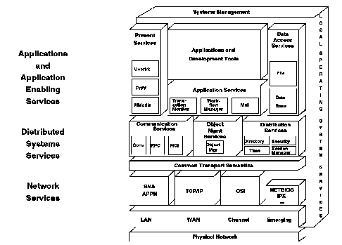

[Previous](2-3-2-1.md) | [Index](README.md) | [Next](2-3-3-1.md)

---

## 2\.3\.3 Open Blueprint Examined

The current form of the Open Blueprint is shown in [Figure 11](11.png)\. It is broken into the following services grouped under these major components:

**Network Services**

- Common Transport Semantics \(CTS\) support protocol\-independent communication services in the Open Blueprint\.
- Transport Network Services provide the protocols for transporting information from one system to another\. These protocols include:

System Network Architecture/Advanced Peer\-to\-Peer Networking \(SNA/APPN\) Transmission Control Protocol/Internet Protocol \(TCP/IP\) Open Systems Interconnection \(OSI\) NetBIOS Internet Packet Exchange \(IPX\)\.

- Subnetworking handles the physical network and specific transmission facilities, such as the Local Area Network \(LAN\), Wide Area Network \(WAN\), channels and emerging technologies like Asynchronous Transfer Mode \(ATM\)\.

**Distributed System Services**

- Communication Services provide communication tools to distributed applications or resource managers\.
- Object Management Services provide language\-independent executable programming blocks\.
- Distribution Services assist the communication between parts of distributed applications and resource managers by providing common functions such as directory, security and time services\.

**Application Enabling Services**

- Presentation Services define the end\-user interface\.
- Application Services are common objects developed in a way that makes them reusable to other applications\.
- Data Access Services give applications and resource managers access to different types of data\.

**Applications and Development Tools**

- These tools assist the application developer in implementing distributed applications by using standard interfaces\.

**Systems Management Services**

- This service provides facilities that the system administrator can use to manage a distributed computing environment\.

**Local Operating System Services**

- These are services which operate within the confines of a single platform, such as storage management, and dispatching work\.

*Figure 11\. Open Blueprint Model*

Subtopics:

- [2\.3\.3\.1 Network Services](2-3-3-1.md)
- [2\.3\.3\.2 Distributed System Services](2-3-3-2.md)
- [2\.3\.3\.3 Application Enabling Services](2-3-3-3.md)
- [2\.3\.3\.4 Applications and Development Tools](2-3-3-4.md)
- [2\.3\.3\.5 Systems Management Services](2-3-3-5.md)
- [2\.3\.3\.6 Local Operating System Services](2-3-3-6.md)
- [2\.3\.3\.7 Integration](2-3-3-7.md)

---

[Previous](2-3-2-1.md) | [Index](README.md) | [Next](2-3-3-1.md)
