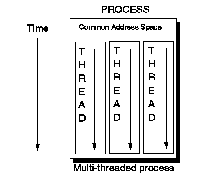

[Previous](2-4.md) | [Index](README.md) | [Next](2-4-2.md)

---

## 2\.4\.1 Threads Service

One of the more important blocks within the DCE model is the threads services\. Threads is the term used by DCE to describe parallelism within an application \([Figure 16](16.png)\)\. A *thread* is a single, sequential flow of control within a program\. The DCE threads service allows the creation, management, and synchronization of multiple threads of controls in a single process\. Generally, a *process* is a program that is in some form of execution\. In UNIX terms, it refers to an entire state of execution including register values, contents of storage, the status of files and other resources associated with the process\.

A process can run multiple threads in parallel\. The threads share the process's address space but they have there own execution stack, which gives them their own local variables\. Threads have access to storage and variables of the process, plus system level shared storage attached to the address space\. Each thread can progress at its own rate with synchronization services provided by DCE\.

*Figure 16\. DCE Threads*

Threads can be exploited by both client and server, allowing a server to service multiple clients simultaneously and allowing a client to work on several requests at the same time\. Threads must be managed, scheduled, and allowed to communicate with one another in a controlled way\.

When it is possible to have more than one thread of control, the threads must be created and destroyed explicitly\. DCE threads provide the facilities for doing this\. When the number of threads to be run are greater than the number of processors available, some decision must be made as to which thread runs first\. The DCE threads scheduling is built on two mechanisms:

- Scheduling priorities
- Scheduling policies

Each thread has a scheduling priority associated with it\. A higher priority thread has precedence over a lower\-priority one\. The exact treatment of threads with different priorities depends on the scheduling policy that is being used\.

When multiple threads are accessing the same resource \(a shared variable, for instance\), incorrect results can occur\. To resolve this problem, the threads need to be synchronized\. DCE threads provide three facilities for this :

- Mutual Exclusion Objects \(mutexes\) In this facility one mutex object is associated with each shared resource\. An attempt to lock the variable's mutex is made when a thread wants to use a shared resource\. If it succeeds in locking the mutex, the thread gains access to the resource and unlocks the mutex when it completes the use of the resource\. If a second thread tries to access the resource while the first thread is accessing it, the second thread is blocked until the mutex is unlocked by the first thread\.
- Condition Variables

A condition variable \(which itself is a shared resource and must be protected by a mutex\) is used for communications between threads\. Using a condition variable, for example, the Thread X can wait for the Thread Y to execute some task\. The Thread X waits on the condition variable until the Thread Y *signals* that condition variable, indicating that particular task has been executed\. Summarizing, the Threads can be synchronized with each other\.

- The Join Routine

This is another synchronization method that allows a thread to wait for some other thread to complete execution before proceeding\.

When a thread generates a signal because of an error, such as

floating\-point exception, this signal is delivered to the process immediately following the instruction that resulted in the overflow\. Instead of having to handle signals directly, DCE threads provides the POSIX sigwait\(\) and sigaction\(\) services\. These services perform activities similar to signal handling\.

Signals should be avoided in multithreaded programs because a thread cannot wait for a synchronous signal, it must be interrupted during execution\. Therefore, a synchronous signal cannot occur for a particular thread while it is waiting, and so the thread waits forever\.

An alternative that is provided by DCE threads is signal a condition variable\. The condition variable was covered earlier in this chapter\.

---

[Previous](2-4.md) | [Index](README.md) | [Next](2-4-2.md)
