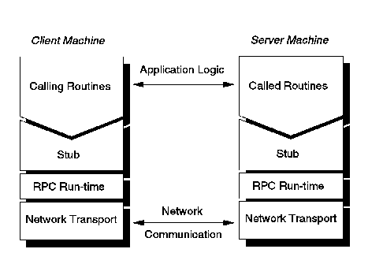
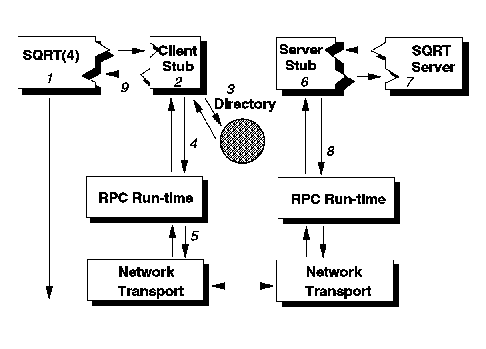

[Previous](2-4-1.md) | [Index](README.md) | [Next](2-4-3.md)

---

## 2\.4\.2 Remote Procedure Call

Possibly the most significant part of the DCE model is the Remote Procedure Call \(RPC\) programming model\. The concept of a procedure call, which passes control of program execution from one segment of code to another, is well know to programmers\. RPC extends this concept to allow the call to be executed on a remote system\.

The DCE model does not specifically mention the conversation or message queueing programming models\. New releases of DCE may include interfaces based on message/queueing models\.

RPC consists of a development tool and a runtime library\. The development tool, a language and compiler, automatically generates code that transforms the procedure calls into network messages\. The runtime library implements the network protocols to allow the client and server to communicate\. Stubs are combinations of generated, executable code and data areas\. They interface between the application issuing the RPC and the RPC runtime library\. The relationship between the stubs, the application and the RPC runtime library is illustrated in [Figure 17](17.png)\.

*Figure 17\. RPC Stubs*

In execution, the server is more like a daemon \(continuously executing process\)\. On the other hand, the code in the client executes more like a library routine\. By handling the client code as a library routine, and coding the IDL much like an API, the code appears to be executed locally\.

The example in [Figure 18](18.png) outlines how a RPC call is processed, namely:

1\. The client application issues a RPC call, in our example called SQRT\.

2\. A client stub called SQRT is actually called\.

3\. The client stub will check the directory to determine the destination\. This process is called *binding*\. \(See Section ["Directory Services" in](2-4-5.md) [topic 2\.4\.5](2-4-5.md) for details of the directory service\.\)

4\. The client stub establishes a connection with the server application, and transforms the parameters into byte streams to transfer them over the network\. This process is called marshalling\.

5\. The client stub sends the call, which is issued by the RPC runtime library, and waits for the reply\.

*Figure 18\. RPC Examples*

6\. The server RPC runtime receives the call for the routine SQRT and calls the server stub\.

7\. The server stub unmarshalls the data and calls the real SQRT process\.

8\. The server stub then returns the data in the same way that the client stub issued the original call\.

9\. The client stub then stores the return values in storage\. A client finds a server by getting the server's host address from the Cell Directory Service \(CDS\) \(see Section ["Directory Services" in topic 2\.4\.5](2-4-5.md) for details of the directory service\) and finding the server process address \(called an endpoint\) by searching the host's endpoint map\.

When an application server initializes, it writes each interface name and associated endpoint into a database called an endpoint map\. Because the machine location is fairly stable, its address can be entered into the Cell Directory Service\. However, the network endpoint can change each time the server process is started up\. Instead of making frequent changes to CDS to update a server's endpoint address, DCE RPC uses a specialized type of directory service, the RPC daemon, or rpcd, that provides the endpoint map service\. One rpcd program runs on each system participating in a DCE Cell\. Except in unusual circumstances, RPC requires little or no administration\. However, if necessary, the administrator can control naming and endpoints for a RPC application through the RPC control rpccp\. This program controls access to servers and interfaces by viewing, adding, removing and modifying information in the namespace \(see Section ["Directory Services"](2-4-5.md) [in topic 2\.4\.5](2-4-5.md) for details of the namespace\)\. The rpccp program can be used to register and unregister endpoints in both local and remote endpoint maps\.

The RPC Application Programming Interface \(API\) is composed of routines available to C/370 programs\. These routines are used by the client and server stub code and are also available for use by the application programmer to control, for example, the association, or binding, of a client to a server during RPC\.

The stubs generated by the DCE IDL compiler use the C language conventions; thus a client written in another language can call an IDL stub in the same way it calls any local C procedure \(provided that the language follows the calling conventions that the stub expects, which may require unconventional programming in languages other than C\)\. DCE RPC is data representation, protocol, machine, and operating system independent\.

The RPC runtime facility is currently supported by two networking transports, TCP \(called "Connection Oriented RPC"\) and UDP \(called "Connection\-less RPC"\)\. Both of these are implemented through the TCP/IP product\. For more information about TCP and UDP, refer to Section ["TCP/IP" in topic 3\.3\.3](3-3-3.md)\.

---

[Previous](2-4-1.md) | [Index](README.md) | [Next](2-4-3.md)
