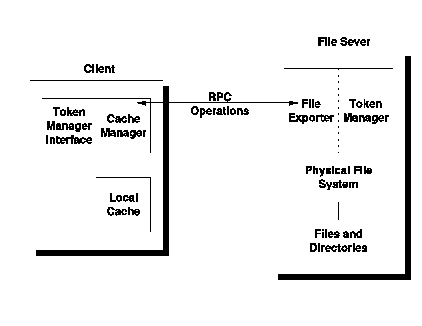

[Previous](2-4-3.md) | [Index](README.md) | [Next](2-4-5.md)

---

## 2\.4\.4 Distributed File System

The DCE Distributed File System is based on the Andrew File System from the Carnegie\-Mellon University, and is a Network File System \(NFS\)\. NFS was developed originally from SUN Microsystems\.

The NFS file system has a UNIX based tree structure\. This means it is directory based, with a hierarchical tree structure\. It supports long file names \(up to 255 characters\) and the file names can be mixed case \(files *Abc* and *aBC* are two unique files\)\. The Distributed File System allows transparent access to remote files\. The remote file systems may be on any system within the network, and could be of a completely different architecture; for example, a MS\-DOS workstation could access files held on a mainframe\.

The terms client and server are used here\. The system on which the user is working is called the client system, and the system on which the file physically resides is known as the server system, or file server\.

The presentation of the files to the client must be exactly as though the files were held locally\. The client should not be concerned with where they physically reside, nor with the format the file server uses to store the data\.

Remote file systems accessed transparently in this way introduce the concept of a universal file system\. In a universal file system, file transfer utilities, such as SENDFILE, are obsolete\. There is no need to send files between users since the file is automatically accessible anywhere\.

In the DCE model for the Distributed File System, a remote file system is accessed by mounting the remote files across a network\. Effectively, this caches the data requested on the client system\. When a client wants access to a file that is physically located on the server site, the part of the file tree that contains the file is mounted on the client's file system\. DFS is made of several components, illustrated in [Figure 19](19.png)\.

*Figure 19\. DCE File System*

On the client, there is a component called the cache manager\. The cache manager requests code from either the local file system or from the file server\.

- The File Server is the computer or service machine on which the data is stored\. It comprises several components:

The file exporter which accepts requests from remote clients\. The token manager which is responsible for tracking who is accessing which file\. This is done by issuing tokens\. A client can request a token for a file or a part of a file\. Tokens can be issued for open, read, or write\.

- The DCE Local File System \(LFS\) where the file physically resides\.

LFS includes features that are very useful in a distributed environment\. These include:

- The ability to replicate data, allowing duplicate copies of the data to be kept on separate servers in case of server failure\.
- High availability\.
- Allowing administration tasks to be performed without the need to bring the file system down\.
- Fast recovery after a system crash\.
- Simplified administration by dividing the file system into smaller, more manageable units called filesets\.

The objectives of the DCE implementation of NFS are to support the NFS protocols and to expand them to include POSIX 1003\.1 \(System Call Interface and Language bindings for C\) and 1003\.1a \(C revisions and additions to 1003\.1\)\.

---

[Previous](2-4-3.md) | [Index](README.md) | [Next](2-4-5.md)
