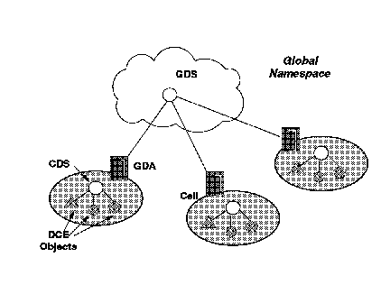

[Previous](2-4-4.md) | [Index](README.md) | [Next](2-4-6.md)

---

## 2\.4\.5 Directory Services

As with the CMS Names function, the directory services, or the naming services, allow user\-oriented names to be mapped directly to DCE objects\. Examples of DCE objects include, users, machines, and services\. This allows applications and users to locate and share information on these objects\.

Allowing the user to use a name for an object removes the complexity of location and routing information from the user\. This, in turn, helps simplify portability of both the users and the objects\. Each object has an entry in the directory\. A directory is a list of name entries called a namespace\. Each object entry in the directory has attributes that describe the object\. The DCE directory service is very flexible\. It allows directories to be organized in many ways; for example, they can be hierarchical lists of users, or they can contain pointers to other directories\. The DCE Directory Service comprises several parts, which are illustrated in [Figure 20](20.png):

- Cell Directory Service \(CDS\)
- Global Directory Service \(GDS\)
- Global Directory Agent \(GDA\)
- Programming Interface Objects

*Figure 20\. DCE Directory Service*

Directory Services exploits the DCE concept of cells\. In a DCE environment the Directory Service handles local and global names\.

The CDS manages the resources and the directory within a cell and has several components, including:

- CDS Server

The CDS Server runs on a node containing a database of directory information\. It stores and maintains CDS names and handles requests to create, modify or look up data\. A CDS database is called a clearinghouse\.

- CDS Clerk

The CDS Clerk runs on the client node and serves as an intermediary between client applications and CDS Servers\. That is because an increase of overhead would be realized if applications had to manage searches involving multiple clearinghouses\.

The Clerk receives a request from a client application, sends the request to a CDS server and returns the resulting information to the client\. This process is called a lookup\.

The CDS Clerk maintains a cache of the information acquired through directory queries\. The next time that a similar query is made, the information is already available on the client node, and no network communications with the CDS Server are necessary\.

To initiate lookup requests, the CDS Clerk must first know where the CDS Server is located\. There are three ways to enable a clerk to find a server:

Through the solicitation and advertisement protocol

With this protocol, a CDS Server periodically broadcasts messages to advertise its existence to Clerks on the same LAN\. The advertisement message contains data about the cell that the server belongs to, the clearinghouse that it manages and the server's network address\. At start up, a CDS Clerk sends solicitation messages which request advertisements\.

During a lookup

If a CDS server does not contain a name that the clerk is searching for, the CDS server gives the clerk as much data as it can about where else to find the name\.

Management command

A CDS administrator can create an entry in a clerk's cache using the CDS control program defining the location of a server\. This is important when the server and clerk are separated by a WAN, and the clerk, therefore, cannot find the server from advertisements on a LAN\.

- CDS Administration Programs

Administrators can use two programs :

cdsbrowser

The CDS namespace browser is a CDS client application that allows inspection of the cell's namespace\. For example, the administrator can monitor growth in the size and number of CDS directories in a namespace\.

cdscp

The CDS control program enables administrators to control the components of the CDS and the contents of the namespace\. For example, the administrator can stop operation of a server\.

The GDS is used for looking up a name that is not found within the local cell\. GDS provides a global namespace that connects all the local cells and implements an international directory service\. The GDA is responsible for communication between the local and global directory services\. When a client requests a service and CDS cannot resolve the name in the local cell, the CDS call is passed to the GDA\. In this sense, GDA acts as a gateway service that allows local cells to be connected\.

This function is transparent to the end user or application developer who interfaces with the directory services through an Application Program Interface \(API\)\. DCE directory service has adopted the global ISO X\.500 standard as its standard\. The API that has been adopted is the X/Open Directory Service \(XDS\) API\. The XDS library knows whether to direct calls or receives to the Global Directory Service or to the Cell Directory Service\. XDS uses the X/Open Object Management \(XOM\) application programming interface to define and manage its information\.

---

[Previous](2-4-4.md) | [Index](README.md) | [Next](2-4-6.md)
