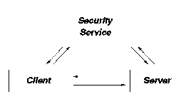

[Previous](2-4-5.md) | [Index](README.md) | [Next](2-4-7.md)

---

## 2\.4\.6 Security Services

Security can be considered in three parts; authentication, authorization, and registration:

- *Authentication* is proving that the user is who he claims to be\. It is managed by an authentication server\.
- *Authorization* is verifying that the user is allowed access to the resource requested, once the system is sure who the user is\. Authorization is managed by a privilege server\.
- *Registration* is managed by a registry server who updates a database of security items such as users, passwords, servers, and encryption keys\.

The system employed by DCE is Kerberos, which was originally developed at the Massachusetts Institute of Technology \(MIT\)\. It takes its name from Greek mythology and the 3\-headed hound that guarded the entry to Hades\. Kerberos authentication is a third\-party authentication system\. In a third\-party system the client and the server are identified to each other using a key, known as a ticket\. This ticket is issued by a third party, in this case the authentication server\. This is illustrated in [Figure 21](21.png)\.

*Figure 21\. Third\-Party Security*

As an example, assume that a client is trying to request a service from an application server\. The client issues a request to an authentication server \(*login*\) to access the application server\. The authentication server returns the ticket in an encrypted form\. The ticket contains authentication of who the user is, plus a session key\. Only the client and the application server know the key to decrypt the ticket\.

The client passes the ticket to the application server who decrypts the ticket using the session key\. The application server now knows who the client is and can then decide to accept or reject the client\. This decision is known as authorization\. Authorization uses the POSIX based Access Control Lists \(ACLs\)\. ACLs match resources against users and user groups, and their associated level of authorization such as read or write\.

The DCE security services make full use of RPC\. As the runtime RPC code decodes the tickets and performs the necessary security checks, the application server is not required to understand or handle the Kerberos security rules\.

---

[Previous](2-4-5.md) | [Index](README.md) | [Next](2-4-7.md)
