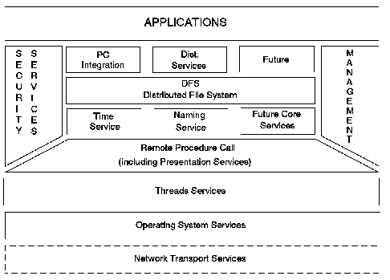
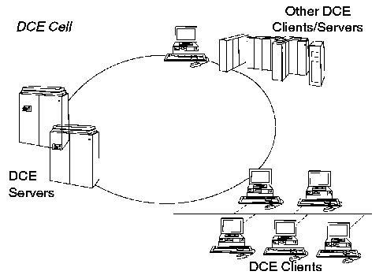

[Previous](2-3-4.md) | [Index](README.md) | [Next](2-4-1.md)

---

# 2\.4 Chapter 6\. Distributed Computing Environment

The most widely recognized model of an open system is the Distributed Computing Environment \(DCE\) model, defined by OSF\. DCE allows full internetworking \(communication between two or more networks\) of distributed, heterogeneous systems\. Because of the existence of POSIX support on non\-UNIX systems, DCE is able offer its unique functions on many platforms\. IBM is shipping DCE for AS/400, AIX and OS/2\. DCE is available for MVS/ESA as "Open Edition/MVS\." Finally, with the arrival of OpenEdition, VM steps into the DCE world as well\. IBM acknowledges the importance of DCE by including some major elements of DCE into the Open Blueprint \(see Section ["Standards" in topic 2\.3\.2\.1](2-3-2-1.md)\)\.

The DCE model is shown in [Figure 14](14.png)\.

*Figure 14\. Distributed Computing Environment Model*

The building blocks within the DCE model fall into two categories: tools for software developers, such as threading, security services, and timer services; and end\-user services, such as a distributed file system, PC integration, and distributed services that include printer support\. These building blocks in DCE have been adopted from existing standards and tools that include:

- Distributed file services \(Transarc Corp\. AFS\)
- Remote Procedure Calls \(NCS RPC\)
- Security Services \(MIT Kerberos\)
- PC Integration \(Microsoft LM/X, Sun PC\-NFS\)
- Directory services \(OSI X\.500\)
- Threads \(Digital Equipment Corporation CMA\)
- Networking Services \(Sockets\)

Since a true Distributed Computing Environment will be implemented across many systems of differing platforms, sizes, and possibly even architectures, the scale of the distributed environment becomes a problem\. In order to reduce complexity, DCE allows systems to be logically grouped into cells\. A cell may correspond to the systems within a specific LAN or workgroup, and may also include a mainframe\. [Figure 15](15.png) shows an example of a DCE cell\.

A cell is considered as a single management unit that is capable of delivering all the services required within that cell, and is therefore able to operate independently of the other cells\.

*Figure 15\. DCE Cell Environment*

OSF defines the minimum configuration of a distributed system that will function as a DCE cell\. It states that each system in the cell has the DCE Executive which contains:

- Remote Procedure Call \(RPC\),
- Time client,
- Security client, and
- Distributed file services \(DFS\) client\.

Within the cell there is at least one instance of:

- A Directory server,
- A Security server, and
- A Time server\.

Here the client refers to the code executed by an application that requests the service, and server refers to the code that performs the service\.

A system that provides these services is said to be DCE compliant\.

The functions provided by each of these services are explained in the sections that follow\.

Subtopics:

- [2\.4\.1 Threads Service](2-4-1.md)
- [2\.4\.2 Remote Procedure Call](2-4-2.md)
- [2\.4\.3 Time Services](2-4-3.md)
- [2\.4\.4 Distributed File System](2-4-4.md)
- [2\.4\.5 Directory Services](2-4-5.md)
- [2\.4\.6 Security Services](2-4-6.md)
- [2\.4\.7 Diskless Support Service \(PC Integration\)](2-4-7.md)
- [2\.4\.8 Management](2-4-8.md)

---

[Previous](2-3-4.md) | [Index](README.md) | [Next](2-4-1.md)
