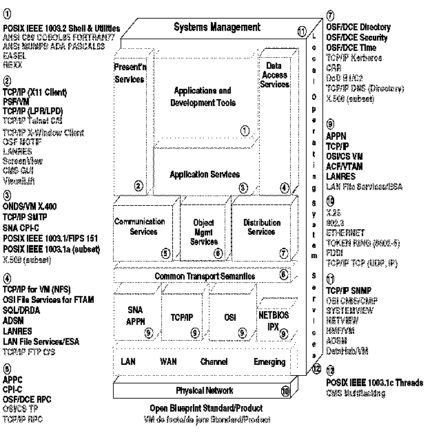

[Previous](3-1-1-1.md) | [Index](README.md) | [Next](3-2.md)

---

### 3\.1\.1\.2 VM Positioning

If VM is to play a part in this Open and Client/Server arena, then it is vital that the key elements of this model be supported\.

IBM has announced that part of the VM/ESA Open Systems Strategy is to extend the VM POSIX direction to include conformance with the XPG4 guidelines in open, distributed environments\. Having established the requirements and where they are met in the Open Blueprint, the next stage is to match VM to the same model\. The Open Blueprint will be shown once more, only this time concentrating on the facilities that VM provides and the products that VM supports\. This is shown in [Figure 23](23.png)\. The criteria used when selecting these products is:

- Adherence to a recognized industry standard, de facto or de jure, as accepted by the Open Blueprint\.
- Providing transparent access to an application service\.

After discussing the new functions delivered in OpenEdition VM, the most important products and functions shown in the figure will be discussed\.

*Figure 23\. Product Mapping of the Open Blueprint for VM*

---

[Previous](3-1-1-1.md) | [Index](README.md) | [Next](3-2.md)
