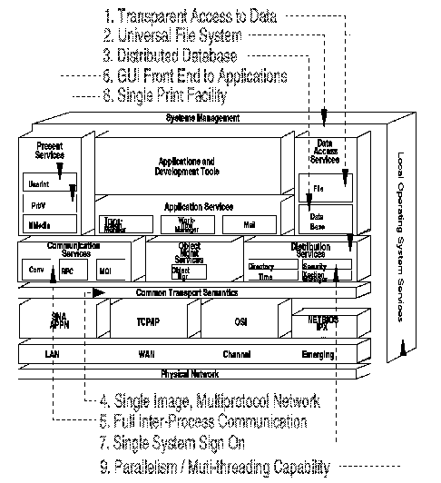

[Previous](3-1.md) | [Index](README.md) | [Next](3-1-1-1.md)

---

## 3\.1\.1 Client/Server \- Completed Picture

You are familiar with the terms Client/Server and Open Systems and their requirements, as detailed in earlier chapters\. We will discuss them again, focussing on how to meet customers expectations through implementation of an Open System model\.

To begin, let us summarize what we have seen in [Part 1, "Introduction" in](<#HDRHPRT100>) [topic 1\.0](<#HDRHPRT100>) and [Part 2, "Overview of the Open World" in topic 2\.0](<#HDRHPRT200>) of this publication\.

In the introduction, Client/Server is described as a set of user expectations, and that these expectations were not precise\. It is proposed that these expectations could be satisfied by implementations of an Open Systems environment, and that an Open System could be defined more exactly\.

In [Part 2, "Overview of the Open World" in topic 2\.0](<#HDRHPRT200>), we focused the study on the Open Blueprint and DCE models\. Other models exist, but it is not the purpose of this document to describe all Open Systems models\.

The Open Blueprint of IBM defines how it sees distributed computing in multivendor environments\. It includes the former Networking Blueprint for the networking layer of the model\. The second model is the OSF Distributed Computing Environment\. This is the most important and most widely accepted model of an Open System in the market place today\. IBM recognizes this and is including DCE compliance in each of its SAA platforms \(VM, MVS, OS/2, OS/400\) as well as AIX\. This commitment is underlined by the inclusion of DCE elements in many of the Open Blueprint building blocks\. Compared to DCE, the Open Blueprint has a broader scope\. To review, the Open Blueprint includes the following elements from DCE:

- Remote Procedure Call
- Directory services, name resolution mechanism
- Security services
- Time services
- Distributed File System

Other major industry standards that IBM recognizes are the POSIX standards from IEEE\. The Open Blueprint includes the following POSIX standards:

**1003\.1** 'System Call Interface and C bindings' **1003\.1c** 'Threading' **1003\.2** 'Shell and Utilities' **1003\.2a** 'User Portability extensions'

To reinforce the opinion that Client/Server is satisfied by the Open Blueprint, we need to go back to our original questions and reexamine the demands and expectations the market place puts on Client/Server computing\.

In Section ["Expectations" in topic 1\.1\.2\.1](1-1-2-1.md) we indicated that the business expectations for Client/Server could be summarized as:

- Improved productivity
- Lower operating costs
- End user data control
- Consolidated information systems

and that these could be achieved through:

- Transparent access to data
- Universal file system
- Distributed database
- Single image, multiprotocol networking
- Full interprocess communication support
- GUI front end to applications
- Single system sign on
- Single print/view facility
- Parallelism/multithreading capability

These requirements reinforce the opinion that Client/Server presents a paradigm shift for the computer industry away from a systems\-centric view to a user\-centric view\.

Having examined the Open Blueprint at a high level, let's return to it and to try to fit the Client/Server requirements to the model\. The Open Blueprint is redrawn in [Figure 22](22.png)\.

Here is a look at each of the requirements in turn:

*Transparent access to data*: Transparent access to data is possibly the most significant requirement placed by the industry on the Client/Server model\.

Transparent access to data cannot be summarized by one single building block in the model\. The scope of transparent access involves the implied networking protocols that provide that access\. Security of the data is also required, as is the ability to transparently identify the file server and its location in the network\. Conversion of the data between the file system requested by the user and the file system employed by the file server is also implied, as is the ability to back up data securely\.

The transport network area masks the underlying protocols to provide transparent access\. The distribution services area provides the directory, security, time, and transaction manager services that locate, protect, synchronize, and process requests transparently\. The data access services area provides whatever data format that is required transparently\. Systems management and local operating system services provide data backup and data conversion services\.

*Figure 22\. Client/Server Requirements and the Open Blueprint*

*Universal file system*: This is clearly defined by the DCE model's DFS which is included in the Open Blueprint in the file application services box\. *Distributed database*: Relational database facilities are supplied in the Open Blueprint by Structured Query Language \(SQL\), Distributed Relational Database Architecture \(DRDA\), and the SQL interface to the relational database resource manager\. *Single image multiprotocol networking*: IBM's Common Transport Semantics and the accompanying paper on Multiprotocol Transport Network defines IBM's position here\. It is one of the key elements of the Open Blueprint without which many of the higher level requirements would not be possible\. *Full interprocess communication*: As part of the Multiprotocol Transport Network, the ability to use any of the three programming models, RPC, Conversational, or Messaging/Queueing, over any of the network protocols is defined\. IBM has already announced the ability to use Sockets over an SNA network, and CPI\-C over TCP/IP\. CPI\-C has been adopted by X/Open\. *GUI front end to applications*: A GUI front end is addressed in the Presentations Services block of the model under the User Interface subarea\.

*Single system sign on*: At this time, there is no indication of how this function will be implemented in VM\. *Single print facility*: A single print/view facility is traditionally one of the weakest parts of any distributed print support\. Most systems have a remote print facility, but they are usually proprietary\. Where intersystem print facilities do exist, they are limited and could not be described as open\.

The Open Blueprint attempts to address this by providing a high\-function print service that covers all Open Systems\. The objective is to provide distributed system support, such that any user can print any file of any file format anywhere, and where the server and printer can be located anywhere in the network\. A variety of printing formats are included in the model\. *Parallelism / Multithreading capability*: The ability of a server to support multiple clients is key to any Client/Server application\. Many of the application services building blocks are dependant upon this parallelism; for example, the file server must be able to support multiple clients\.

The POSIX 1003\.1c standard defines threading as a way of providing this level of parallelism, and this is included in the Open Blueprint\.

Subtopics:

- [3\.1\.1\.1 Is Client/Server a Model](3-1-1-1.md)
- [3\.1\.1\.2 VM Positioning](3-1-1-2.md)

---

[Previous](3-1.md) | [Index](README.md) | [Next](3-1-1-1.md)
