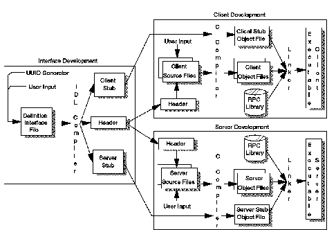

[Previous](3-2-2-1.md) | [Index](README.md) | [Next](3-2-2-3.md)

---

### 3\.2\.2\.2 DCE Remote Procedure Call in VM/ESA

The DCE Remote Procedure Call is the base of distributed computing on a DCE environment offering a powerful and simple method for developing distributed applications\. A programmer writing a distributed application defines the interface between the clients and the servers\. This definition begins with the generation of a universal unique identifier \(UUID\) through the UUIDGEN utility\. The UUIDGEN creates a template for the interface definition file which contains the UUID\. The application programmer must fill in the contents of this file in order to define the complete interface using the Interface Definition Language \(IDL\)\. The IDL looks like the C programming language with the addition of some attributes\. An IDL file is shown in [Figure 30](3-2-2-2.md#FIGIDLEXMP)\. It includes the definitions of the operations comprising the interface\. In this example, there is only one operation, called *greet*\.

<a id="FIGIDLEXMP"></a>

```
 |   /*
 |    * greet.idl
 |    *
 |    */
 |    [uuid(3d6ead56-06e3-11ca-8dd1-826901beabcd),
 |    version(1.0)]

 |    interface greetif
 |    {
 |        const long int REPLY_SIZE = 100;
 |        void greet(
 |           [in]         handle_t h,
 |           [in, string] char client_greeting[],
 |           [out, string]char server_reply[REPLY_SIZE]
 |        );
 |    }
```

*Figure 30\. IDL File Sample*

The IDL complier generates C language source stub code from the IDL files, and can automatically call the C/370 complier to produce object code stubs\. The IDL compiler generates the client stub code, server stub code and the application header file that supports the data types in the interface definition\. After this, the application programmer writes the client application code in the C language\. The C *\#include* directive reads the header file when the client application code is compiled\. To produce the executable client application, the client C language stub code is compiled with the C compiler and linked with the client application object code and RPC runtime code\.

For the server side, the process is the same, except the C language server stub code is complied and linked wit the application and RPC runtime code\. [Figure 31](31.png) details the above process\.

<a id="FIGDISTASK"></a>



*Figure 31\. Distributed Application Development Tasks*

The Network Data Representation \(NDR\) library is a DCE RPC runtime library component\. It is a set of encoding routines used for the network transmission of data and the conversion to and from different data representations\. NDR is DCE's way of handling the incompatible data representations found in a heterogeneous network\. Since all RPC communication is based on sockets, TCP/IP must be installed to use DCE RPC\. For more information about sockets, see ["Ports and](<#HDRHTCP114>) [Sockets" in topic 3\.3\.3\.1\.5](<#HDRHTCP114>)\.

VM/ESA Version 2 provides the complete structure for connection\-less \(Datagram\) RPC\. Connection\-oriented RPC is not supported in this release\.

---

[Previous](3-2-2-1.md) | [Index](README.md) | [Next](3-2-2-3.md)
