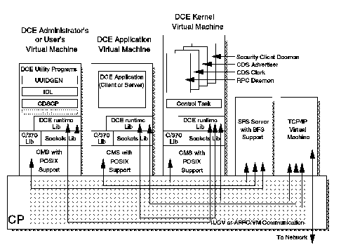

[Previous](3-2-2-4.md) | [Index](README.md) | [Next](3-2-2-6.md)

---

### 3\.2\.2\.5 How OpenEdition VM Implements DCE

This section contains a brief explanation about the OSF DCE implementation in VM/ESA, as well the interface between the DCE services \(RPC, CDS, and Security\)\. The basis for the following discussion is shown in [Figure 32](32.png)\.

*Figure 32\. DCE Implementation on VM/ESA*

In general, the DCE function, as implemented on VM, can be grouped into three areas: runtime support, daemon processes, and utility programs\.

**Runtime Support** A collection of runtime library code that supports the use of DCE\. A logical instance of this library resides within the virtual machine running a DCE application, DCE daemon process or DCE utility program\. This code provides a collection of C language callable functions used by DCE applications, daemons, and utility programs\.

This runtime library will be packaged so it can be placed in a shared segment and a single physical instance of the code shared among all of the virtual machines using DCE\. Each virtual machine using this segment will have its own instance of the data maintained by this library\.

**Daemon Processes** Daemon processes provide DCE services for all DCE users on a particular VM system\. These processes run as individual POSIX processes within a new DCE Kernel virtual machine\. A *control task* process initiates the execution of the daemon processes and provides automatic restart if a daemon fails\.

The daemons running in the DCE Kernel virtual machines are the:

- security client,
- CDS advertiser,
- CDS clerk,
- and the RPC daemon\.

**Utility Programs** A set of utility programs for use in developing DCE applications and for administering DCE\. These utility programs run as POSIX programs within the application developer's, administrator's, or user's virtual machines\. Utilities include the IDL, UUIDGEN, RPCCP, and CDSCP programs, to name a few\.

Because DCE is implemented in C and is used from C language programs, any environment running DCE requires the support of the C/370 and LE/370 runtime libraries\. The DCE runtime library and the DCE Kernel machine use an new, thread\-aware implementation of the Berkeley Software Distribution \(BSD\) sockets library for its communication with TCPIP\. This sockets library also provides for local communication in the form of local sockets, which are implemented through IUCV communication\. This new library is also supported for use by non\-DCE application programs that want direct access to the BSD sockets API\. However, use of the sockets API by DCE applications is not supported\.

The DCE runtime library and the DCE Kernel processes require some configuration files to control their operations\. The DCE security client code creates files to hold the information obtained when a user logs into the DCE cell\. Because these files must be accessible both to the DCE Kernel processes and to DCE library code running in application or user machines, they will be stored as POSIX files in a DCE\-specific subdirectory tree of the Byte File System \(BFS\)\. Also stored in the BFS, are C language header files and IDL files used in developing DCE applications\.

Although the POSIX shell is not shown in the diagram, DCE supports use of the shell as an environment for DCE application development, application execution, and DCE administration\. All of these tasks can be accomplished outside of the POSIX shell as well\.

---

[Previous](3-2-2-4.md) | [Index](README.md) | [Next](3-2-2-6.md)
