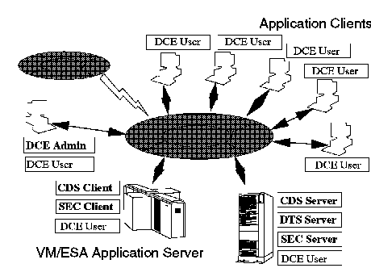

[Previous](3-2-1-4.md) | [Index](README.md) | [Next](3-2-2-1.md)

---

## 3\.2\.2 VM/ESA OpenEdition DCE Feature

<a id="HDRHDCE210"></a>

<a id="TBLTBLUNIQ6"></a>


```
 |                 The OpenEdition DCE Feature for VM/ESA is based on OSF DCE 1.0.3
 |                 and is packaged as a separately ordered feature.  This feature
 |                 consists of the following components:

 |                 °   DCE Threads

 |                 °   DCE RPC (Remote Procedure Call)

 |                     -   IDL (Interface Definition Language) compiler
SI RTL, DCE RPC
 |                     -   RTL (Runtime Library Facility)
SI UUID, DCE RPC
 |                     -   UUID (Universal Unique Identifier) generator
 |                     -   RPC API suite
 |                     -   RPC Daemon (endpoint mapper)
 |                     -   RPC Control Program (administration utility)
```

- DCE CDS \(Cell Directory Service\) Client

CDS Advertiser CDS Clerk CDS Control Program \(administration utility\) XDS/XOM \(X/Open Directory Service / X/Open Object Management\)

- DCE Security Service Client

Security API suite Security Client daemon Registry editor Access Control List editor DCE login utility

VM/ESA Version 2 OpenEdition Release 1 does *not* include:

- DCE Distributed Time Service \(DTS\)
- Connection\-oriented RPC
- DCE Security Server
- DCE Cell Directory Server
- DCE Global Directory Server \(X\.500 directory services\)
- DCE Global Directory Agent \(X\.500 or DNS cross cell services\)
- DCE Distributed File System \(DFS\)
- DCE Diskless support \(PC support functions\)

Every DCE cell must have at least one Cell Directory Server, one Distributed Time Server, and one Security Server\. Thus, the DCE cell must currently contain at least one non\-VM system, such as AIX, that is executing the DCE CDS Server, DTS Server, and Security Server\. Even though there is no DTS on VM, a Time Server is required for other functions inside the cell\. For more details about all the DCE components, refer to [Chapter 6, "Distributed Computing Environment" in topic 2\.4](2-4.md)\.

[Figure 29](30.png) illustrates a VM/ESA system within a DCE cell\.

<a id="FIGVMDCELL"></a>



*Figure 29\. VM/ESA in a DCE Cell*

Subtopics:

- [3\.2\.2\.1 DCE Threads in VM/ESA](3-2-2-1.md)
- [3\.2\.2\.2 DCE Remote Procedure Call in VM/ESA](3-2-2-2.md)
- [3\.2\.2\.3 DCE Cell Directory Service in VM/ESA](3-2-2-3.md)
- [3\.2\.2\.4 DCE Security Service in VM/ESA](3-2-2-4.md)
- [3\.2\.2\.5 How OpenEdition VM Implements DCE](3-2-2-5.md)
- [3\.2\.2\.6 DCE Interfacing with POSIX](3-2-2-6.md)

---

[Previous](3-2-1-4.md) | [Index](README.md) | [Next](3-2-2-1.md)
