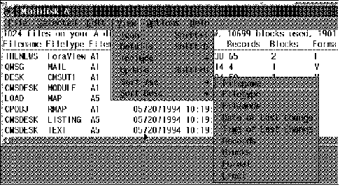

[Previous](3-2-3-2.md) | [Index](README.md) | [Next](3-2-3-4.md)

---

### 3\.2\.3\.3 The CMS Desktop

With the initial release, the main CMS Desktop container will contain icons representing tasks for the CMS end user\.

The tasks that will be initially covered by the CMS Desktop are in the following areas:

*File editing*: XEDIT, still one of the most function\-rich editors, now gets GUI functions \(such as menu bar, pull\-down menus\), while also keeping the current 3270 capabilities \(such as a command line\)\. XEDIT will be able to multitask on the desktop; this means that XEDIT can be actively used in multiple desktop windows\.

XEDIT remains available, and supported, on 3270 sessions as well; a new option instructs XEDIT to use the GUI Interface\. XEDIT support can be used with the CMS desktop, or independently of it\.

*File management*: Here we find FILELIST\- and DIRLIST\-like utilities, as well as information about linked minidisks and accessed minidisks or directories\. Both SFS and BFS are supported\.

As opposed to the classical FILELIST\-like functions on VM, that are completely based on XEDIT, these functions exploit the workstation's GUI facilities; in other words, the new functions do not call XEDIT in a desktop window\. The design of these functions are based on the principles of CUA 91\. Basically their window is a large scrollable list box and an action bar with pulldown menus\. The options in the pulldown menus will compensate for the functions XEDIT commands were used for, such as sorting the list\.

The way we issue the same CMS command on multiple files, by typing an equal \(=\) sign before the files, will be compatible with workstation habits: the files to act upon will first be "selected"; selection is usually done with the mouse\. [Figure 33](34.png) shows a prototype of a file management window with pull\-down menus\.

*Figure 33\. File Management Prototype*

*Interuser communication*: This set of functions comprises management for reader files \(Mailbox\), messages \(both send and receive\) and nicknames\.

The design of the messages application, for example, will be much more usable than what is possible with TELL on a 3270, with or without CMS fullscreen\. Based on early information, the Messages panel will have three important areas:

- A user ID input area: Here one specifies the addressee's user ID or nickname\.
- A message output list box\. This scrollable area contains the past messages traffic\.
- An input area to edit the messages being sent to the addressee\.

The text entered in the input area will be sent to the VM host where TELL is used to actually send the message\. TELL uses nicknames, if available\. This enables sending a message to a group of people\.

**Note:** messages delivered to the CMS Desktop will not be presented to an existing 3270 session\. This is required to avoid the 3270 session going in "MORE\.\.\." or "HOLDING" status, which would place the VM user ID in wait, therefore disabling all CMS GUI applications\.

*Desktop initialization*: The CMS desktop may be started from an active CMS session, or from the workstation, by double clicking on the CMS Desktop object\.

- **From CMS, with the CMSDESK command\.** In which case an active 3270 emulation session is required\.
- **From the workstation\.** With this VM release, REXEC from TCP/IP is required; 3270 emulation is not required\. To make this look nice, many users will hide the appropriate REXEC command behind an icon on their desktop\.

Similar support should be possible for SNA using APPC Private Resource Conversation support\.

---

[Previous](3-2-3-2.md) | [Index](README.md) | [Next](3-2-3-4.md)
