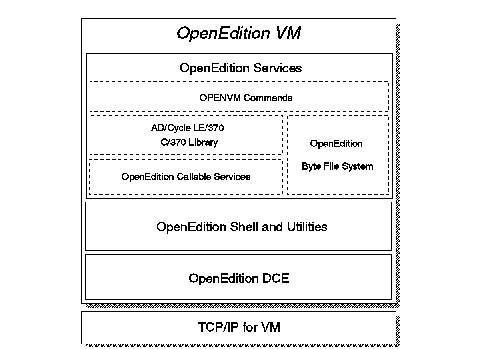

[Previous](3-1-1-2.md) | [Index](README.md) | [Next](3-2-1.md)

---

# 3\.2 Chapter 9\. Opening up VM with OpenEdition

VM/ESA Version 2 expands VM's role in open systems environments by enabling VM applications to participate in heterogeneous, multivendor, distributed computing environments\. The addition of POSIX, DCE, and GUI support in VM/ESA Version 2 provides added function allowing this participation\.

It is important to note that some of the above functions are not necessarily part of the base of VM/ESA Version 2, but are offered as separate features\.

OpenEdition VM refers to services offered in VM/ESA Version 2 that provide industry standard interfaces for applications and users\. It consists of three main parts \(see [Figure 24](24.png)\):

- OpenEdition VM Services
- OpenEdition VM Shell and Utilities Feature
- OpenEdition VM Distributed Computing Environment \(DCE\)\.

Section ["OpenEdition VM \- POSIX Support"](3-2-1.md) will be focussing on the first two parts, with the OpenEdition VM DCE implementation being covered in ["VM/ESA OpenEdition DCE Feature" in topic 3\.2\.2](3-2-2.md)\. Note that TCP/IP for VM is shown in [Figure 24](24.png) since it is a prerequisite for running DCE applications\.

*Figure 24\. OpenEdition VM Overview*

Subtopics:

- [3\.2\.1 OpenEdition VM \- POSIX Support](3-2-1.md)
- [3\.2\.2 VM/ESA OpenEdition DCE Feature](3-2-2.md)
- [3\.2\.3 Native CMS GUI Support](3-2-3.md)

---

[Previous](3-1-1-2.md) | [Index](README.md) | [Next](3-2-1.md)
