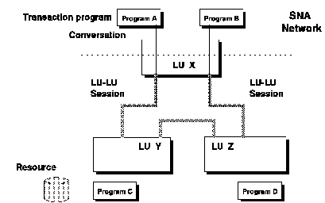

[Previous](3-3-1.md) | [Index](README.md) | [Next](3-3-1-2.md)

---

### 3\.3\.1\.1 SNA Terminology

Before describing APPC, it is necessary to define some SNA terms and concepts\. These terms are shown pictorially in [Figure 34](36.png)\.

**Nodes** A SNA network is a configuration of nodes and links consisting of processors, communication controllers, and workstations\. Nodes are the components that send and receive data from the network\. **Logical Units \(LUs\)** Allow a user to gain access to network resources \(programs, terminals\) and communicate with other users\. **LU 6\.2** A type of SNA logical unit that provides a connection between users and network resources\. The protocol that LU6\.2 provides is APPC\.

**Session** A logical connection between two LUs\. LU Type 6\.2 may support more than one session concurrently with the same partner, and also may support sessions with multiple LUs\. This is called parallel sessions\.

**Mode Name** The characteristics that describe a session\. **Transaction Program \(TP\)** An application program through which users access resources in a network\. **Conversation** A logical connection between two transaction programs\. Every conversation requires a session\. Only one conversation at a time can exist per session, serially\. But, if the LU supports parallel sessions, more than one conversation may take place\.

[Figure 34](36.png) also represents a logical view of a SNA network\. In it, there are three LUs\. The LUs could be separate VM systems or gateways on the same VM system\. The physical network is not important since it is transparent to an application using CPI\-C\.

*Figure 34\. APPC Terms and Concepts*

Communication between LUs is said to be a LU\-LU Session\. Communication between programs using CPI\-C is said to be a conversation, and the programs involved are termed partners\. There are two types of partners, local and remote\. The terms are interchangeable, depending on your point of view\. In the figure above, program C is the remote partner to program A, and vice versa\.

---

[Previous](3-3-1.md) | [Index](README.md) | [Next](3-3-1-2.md)
