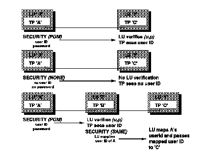

[Previous](3-3-1-1.md) | [Index](README.md) | [Next](3-3-1-3.md)

---

### 3\.3\.1\.2 APPC Conversation Fundamentals

Communication between TPs is called a conversation\. One TP calls the other and they converse in half\-duplex mode, with one listening while the other one talks until they finish the conversation\.

A conversation is started with an *allocate* call that contains the address of the other partner\. This address is made up of the LU name where the TP resides, the TP name, and the SNA mode name\.

Once the call is accepted by the partner, they can continue talking, in turn, until either one decides to end the conversation\. Just like a telephone, a session can only have one conversation at a time, but a session can support many conversations in sequence\.

Consider the case where a remote user tries to access a resource, controlled by a TP on the local system\. A conversation is established between the remote user and the local TP\. Through this conversation, user IDs and passwords can be used to authorize the TP or authenticate the LU, therefore, verifying the user ID and protecting the resource\.

A remote user trying to access a resource will identify that resource by the resource name, and may supply a user ID and password\. The resource manager, the TP that controls the resource, sees the remote user by this user ID, and can decide to allow access or not\. Before the user ID can be passed to the resource manager, that user ID must be authenticated first\. APPC/VM provides three levels of user authentication by using three security types\. The three levels, shown in [Figure 35](37.png), are:

**SECURITY\(PGM\)** This is similar to logging on to the remote system\. The user ID and password supplied by the remote program to APPC is verified by the local LU against the CP directory\. If the user ID and password are valid on that system, then the authentication is valid\. **SECURITY\(NONE\)** No user ID and password is supplied\. **SECURITY\(SAME\)** This level indicates that the user ID and password have already been validated by the remote LU and the local LU trusts this judgement\.

With all three levels of security, the authentication is done before the call is passed to the local TP, the resource manager\. Once the call has been passed, the resource manager may still choose not to authorize the call\. For example, DB2/VM and SFS both refuse APPC connections with SECURITY\(NONE\), and have their own tables of user IDs that are allowed to connect\.

*Figure 35\. APPC/VM Access Security Types*

---

[Previous](3-3-1-1.md) | [Index](README.md) | [Next](3-3-1-3.md)
