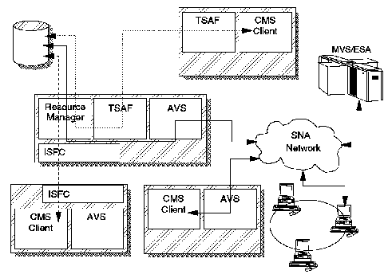
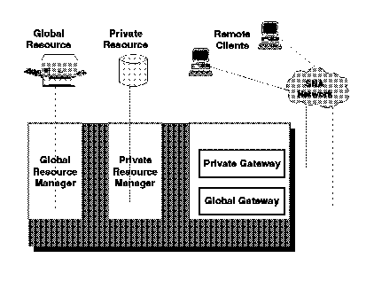

[Previous](3-3-1-3.md) | [Index](README.md) | [Next](3-3-1-5.md)

---

### 3\.3\.1\.4 Remote Access Servers

Remote access to VM resources using APPC can be through one of three methods \([Figure 37](39.png)\)\.

- For access through a SNA network, APPC/VM VTAM Support \(**AVS**\) can be used\.
- Transparent Services Access Facility \(**TSAF**\) can be used for VM to VM communication using bisync or CTC communications\.
- For access from another VM system the Inter\-System Facility for Communications \(**ISFC**\) can be used\. VM to VM communication requires a CTC\.

*Figure 37\. APPC/VM Remote Access*

*AVS*: For SNA connections, the AVS communications server is used\. AVS is a VTAM application that runs as an authorized Group Control System \(GCS\) member\. It translates APPC/VM verbs to APPC/VTAM verbs and back again\.

Programs in a SNA network see the resources in a VM system as transaction programs at LUs\. These LUs, which are defined to VTAM, are defined to VM as gateways managed by the AVS virtual machine, a gateway into and out of the VM system\(s\)\. An incoming APPC request uses the gateway name as the LU name\.

There are two types of gateways, global and private \(See [Figure 38](40.png)\)\. Each gateway is identified by a name to CP by using \*IDENT in the same way as a global resource\. This provides a way for a VM system in a TSAF or CS collection to use resources defined on other VM systems\.

*Figure 38\. AVS Gateways*

To explain the difference between private and global gateways, we need to go back to the origins of APPC and LU6\.2\. LU6\.2 was developed for communication with CICS in a SNA network, so the calling partner had to specify the LUname of the target CICS and the transaction program name \(TPN\) that CICS should start\. For authentication, the caller can also specify a user ID and password\. So for an incoming request, AVS gets four fields from VTAM that can be used: LUname, TPN, user ID, and password\. AVS can use them differently to translate the request in VM terms\. For all types of resources the TPN is used as the VM resource name\. The LUname always points to an AVS gateway, Global or Private:

- **Global gateway:** A global gateway gives access to global resources\. To access a global resource, the specified LUname must be the name of a GLOBAL AVS gateway, while the TPN is the name of the global resource\. Global resources are known to CP when the resource manager is started and connects to \*IDENT\. The security user ID is used for authentication only\.
- **Private resources:** Private resources are different from global resources since they do not connect to \*IDENT, therefore not identifying themselves to CP, and do not have to be logged on when a request arrives\. AVS defines two kinds of gateways to access private resources:

**Dedicated private gateway:** This gateway is dedicated to the virtual machine managing the private resource; that is, any request to that gateway will be routed to the same resource manager\. The security user ID is used for authentication only\.

**Non\-Dedicated private gateway:** Here AVS routes the request to the user ID specified in the APPC program's request\. This gives access to a user's private resources\.

The TPN is forwarded to the resource manager, and is used as the key to the search in the $SERVER$ NAMES file\.

*TSAF*: TSAF can be used to interconnect VM systems\. Up to eight VM systems can be interconnected to form what is known as a *TSAF Collection*\. Although not directly related to Open Systems, TSAF can be useful\. TSAF collections appear to the outside APPC world almost as one system; therefore, only one of the VM systems in the collection require an AVS machine\. It is through this one AVS machine that all AVS global gateways and global resources are accessible from any system in a TSAF collection\.

TSAF is managed by a single virtual machine that operates as the collection resource manager\. When a resource manager identifies itself to CP, CP updates its own local table and, for global resources, notifies the collection resource manager \(the TSAF service machine\)\. TSAF then exchanges information with other TSAF virtual machines in the collection\. In this way TSAF maintains a global resource table for all global resources in the collection\.

When an incoming request arrives through AVS, AVS routes the request to CP\. CP checks its own resource name table, and if CP is unable to find the resource, it passes the request on to TSAF\. *ISFC*: ISFC supports VM to VM communications similar to TSAF\. Interconnected VM systems are termed *CS collections*\. For performance reasons, ISFC is implemented as a component of CP rather than a virtual machine\.

ISFC maintains a system gateway to VM resources in the same way that AVS manages gateways to the SNA network\. ISFC makes no distinction between global and private gateways; hence, only one gateway is needed per system\. This gateway is automatically defined and started at IPL time with the name of the VM system that is defined in the SYSTEM CONFIG file, or HCPSYS\.

---

[Previous](3-3-1-3.md) | [Index](README.md) | [Next](3-3-1-5.md)
