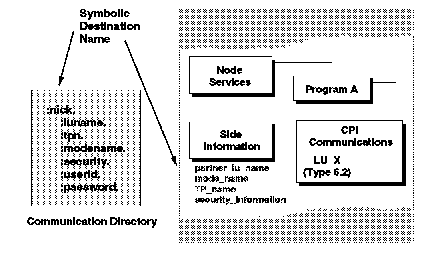

[Previous](3-3-1-4.md) | [Index](README.md) | [Next](3-3-1-6.md)

---

### 3\.3\.1\.5 VM and LU Names

When starting an APPC communication with a partner, not only must the resource name be specified, but also the address of that resource\. This is known as the *locally known LU name*\.

The locally known LU name comes in two parts\. The first part, the *LU\_name\_qualifier*, is the name of the network in which the LU resides\. The second part is the *target\_LU\_name*, the name of that LU\.

- For transactions going out over AVS, a real fully qualified LU name has to be specified\. The LU\_name\_qualifier is an AVS gateway name, and the target\_LU\_name is the LU name where the resource resides\.
- For transactions in the same system or in the same VM collection the locally known LU name has a special format:

For global and local resources the LU\_name\_qualifier is *\*IDENT*, and the target\_LU\_name is set to *0* \(global and local resources identified themselves to CP using \*IDENT\)\.

For private resources, the LU\_name\_qualifier is set to *\*USERID* and the target\_LU\_name is set to the user ID that runs the resource manager\.

Specifying the LU name, TP name, security user ID, and password for every resource is tedious and clumsy if it is hard coded into a program\. APPC/VM allows the use of a symbolic destination name, or nickname for a resource\. A program can use this nickname to identify the resource and APPC will find the rest of the information from a control file called the communications directory, shown in [Figure 39](41.png)\.

*Figure 39\. APPC Communications Directory*

A communications directory file is a CMS file that assigns a symbolic destination name to each locally known LU name and resource name; for example, a symbolic name for a SQL database\. The user program only has to know the symbolic name; the rest of the information is held in the communications directory\. The tags within the CMS communications directory are:

**:nick\.** The symbolic destination name\.

**:luname\.** A pair of LU names\. The LU name of the local gateway, followed by the LU name of the target resource\. **:tpn\.** The transaction program name; in other words the name of the module that will be executed\.

**:modename\.** The SNA mode name for the session\.

**:security\.** The security level required by the requestor program\.

**:userid\.** The security user ID for security\(pgm\)\.

**:password\.** The security password for security\(pgm\)\.

Of these fields, only :luname, :tpn, and :security must be specified\. To avoid coding user IDs and passwords in a CMS file, one can use APPCPASS statements in the CP directory\.

The default CMS communications directories are the UCOMDIR NAMES and the SCOMDIR NAMES files\. Duplicate definitions found in the UCOMDIR names file takes precedence over those from the SCOMDIR NAMES file\. Definitions in a communications directory can also be used to define an alias for a resource name\.

---

[Previous](3-3-1-4.md) | [Index](README.md) | [Next](3-3-1-6.md)
