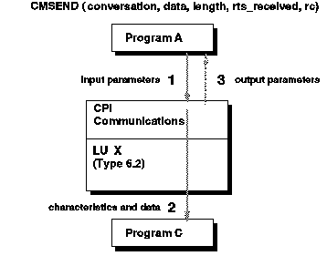
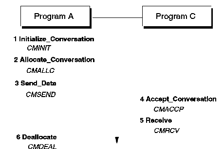
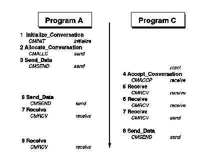

[Previous](3-3-1-5.md) | [Index](README.md) | [Next](3-3-1-7.md)

---

### 3\.3\.1\.6 CPI\-C

CPI\-C is part of the SAA solution for consistent application programming interfaces\. CPI\-C provides the application programming interface for program\-to\-program communications, exploiting SNA's LU 6\.2 architecture\.

Using CPI\-C, application programs have a standard interface to allow them to send and receive data, synchronize programs, and be notified of errors\. CPI\-C programs are made up of CPI\-C calls\. These calls each have a specific format; an example is given in [Figure 40](42.png) of the format for the Send\_Data call\. Each CPI\-C call, for example CMSEND, begins with the string CM, and has a pseudonym associated with it; for example, Send\_Data\. The pseudonym will often be referred to in preference to the call name to make the reading easier\.

*Figure 40\. CPI\-C Program Calls \- Overview*

Calls are used to pass data and status information between the partners, and determine conversation characteristics\.

Characteristics of the conversation are also set by certain program calls\. For example, the send\_type and receive\_type characteristics determine how the conversation will send and receive data\. These characteristics have acceptable default values but can be overridden if necessary\.

For a simple conversation the starter set of calls is sufficient\. There are six in this set, and they include:

**CMINIT** Initialize\_Conversation\. This identifies the target for the conversation by the symbolic destination name\.

**CMALLC** Allocate\_Conversation requests that a conversation begins once the initialize is issued\.

**CMACCP** The target has to issue an Accept\_Conversation for the conversation to continue\.

**CMSEND** Send\_Data is used to send data to the target\.

**CMRCV** Receive\_Data is used to receive data that was sent\.

**CMDEAL** All conversations should be closed cleanly using the deallocate command\.

[Figure 41](43.png) shows an example of the 6\-stage process involved in a very basic conversation using just the starter set of CPI\-C calls:

1\. The conversation is initialized by program A\. This identifies program C as the remote end of the conversation\. The characteristics for the conversation are now set\.

2\. A conversation is allocated\. This starts the conversation that was initialized with the previous call\.

3\. Data can now be sent to the partner\.

4\. The remote partner now issues the accept\.

5\. The data can now be received\.

6\. Once program A knows that the data was received successfully, the conversation can be ended using the deallocate call\.

*Figure 41\. CPI\-C Program Flow \- 1\-way Data Traffic*

**Note:** With CMALLC, buffering may take place\. If the data is buffered, the first transmission will likely not only contain the allocate request, but also some data generated with CMSEND\.

When coding CPI\-C programs it is important to be aware of the state a program is in at any given time\. The states are:

**Reset** No conversation exists

**Initialize** Initialize has completed successfully

**Send** The program may send data

**Receive** The program can receive data

**Send\-Pending** The program was receiving and now has control to send data Most CPI\-C programs are required to both send and receive data\. Program states are important in this case since an APPC conversation is half\-duplex\. A program must be able to tell when it is in send or receive state\. A 2\-way data flow can easily be achieved with the starter set\. [Figure 42](44.png) shows an example of 2\-way data flow\.

In this example, steps 1 to 5 continue as before\. In step 6, program A continues to send data that is received by program C\. To change from send to receive state, the program issues a Receive \(CMRCV\) call\. This places program A into a wait\.

When program A issues the Receive call in step 7, the CMRCV in step 7 of program C will end with a CM\_Send\_Received status indicator\. When program C tests its status indicator field, it will know it can send data while program A can start to receive data\.

*Figure 42\. CPI\-C Program Flow \- 2\-way Data Traffic*

---

[Previous](3-3-1-5.md) | [Index](README.md) | [Next](3-3-1-7.md)
