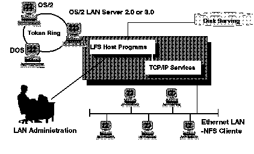

[Previous](3-3-10.md) | [Index](README.md) | [Next](3-3-10-2.md)

---

### 3\.3\.10\.1 LFS/ESA Implementation

LFS/ESA has slightly different implementations depending on whether it is running in an OS/2 LAN Server \(OLS\) or Network File Server \(NFS\) environment\.

In an OLS environment, LFS/ESA has three parts:

- A LFS server virtual machine running on VM that uses Microsoft Server Message Block \(SMB\) protocol to talk to the OS/2 LAN Server
- A LFS administration virtual machine running on VM
- An OS/2 LAN Server with LFS/ESA code installed which acts as a Front End Processor \(FEP\) to VM for the LAN

In a NFS environment, there are two basic parts:

- A LFS server virtual machine running VM that uses NFS Remote Procedure Call \(RPC\) protocol to talk to the network
- A LFS administration virtual machine running on VM

These environments are illustrated in [Figure 68](78.png)\.

*Figure 68\. LFS/ESA Overview*

---

[Previous](3-3-10.md) | [Index](README.md) | [Next](3-3-10-2.md)
