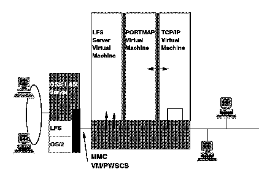

[Previous](3-3-10-1.md) | [Index](README.md) | [Next](3-3-10-3.md)

---

### 3\.3\.10\.2 Connectivity

The connectivity options for LFS/ESA are shown in [Figure 69](79.png)\. There are two different connectivity environments using LFS/ESA:

- OS/2 LAN Server \(OLS\) connection
- NFS connection

*Figure 69\. LFS/ESA Connectivity Options*

Subtopics:

- [3\.3\.10\.2\.1 OS/2 LAN Server Connection](<#3.3.10.2.1>)
- [3\.3\.10\.2\.2 NFS Connection](<#3.3.10.2.2>)

---

[Previous](3-3-10-1.md) | [Index](README.md) | [Next](3-3-10-3.md)
