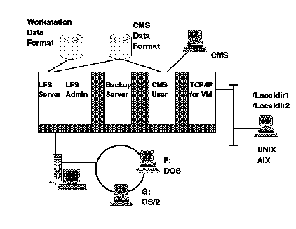

[Previous](3-3-10-3.md) | [Index](README.md) | [Next](3-3-10-5.md)

---

### 3\.3\.10\.4 LFS/ESA Minidisk Support

LFS/ESA provides support for CMS format minidisks and workstation format minidisks\.

CMS format minidisks can be accessed by both workstation users and CMS users\. When a workstation user accesses a file stored on a CMS minidisk, the LFS/ESA server performs the necessary translation so that the file appears like a normal workstation file to the user\. \([Figure 70](80.png)\)\.

Native workstation data formats, file attributes, and naming conventions are supported on workstation format minidisks\. Data on this type of minidisk does not need to be translated when accessed by a workstation user, making the access time much quicker\. CMS users cannot access data on this type of minidisk directly\. Instead, using the LFS COPY command, data can be moved from a LFS directory on a workstation minidisk to a CMS minidisk, with the LFS COPY command doing the necessary translation\.

*Figure 70\. LFS/ESA File Sharing*

Subtopics:

- [3\.3\.10\.4\.1 Workstation File Naming Conventions](<#3.3.10.4.1>)
- [3\.3\.10\.4\.2 Workstation Format Minidisk Attributes](<#3.3.10.4.2>)

---

[Previous](3-3-10-3.md) | [Index](README.md) | [Next](3-3-10-5.md)
