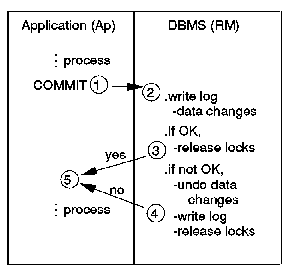
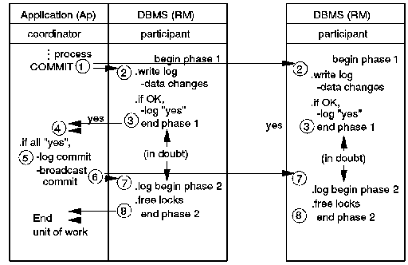

[Previous](3-3-13.md) | [Index](README.md) | [Next](3-3-13-2.md)

---

### 3\.3\.13\.1 IBM's Distributed Relational Database

IBM's SAA introduced distributed support for databases with its Distributed Relational Database \(DRDB\)\. DRDB provides for transparent access to distributed relational database tables between SAA environments using the SAA Database Interface, SQL\. Transparent access is supported by an architecture called the Distributed Relational Database Architecture \(DRDA\)\. Before explaining the functions of DRDA, some concepts have to be defined\.

A distributed relational database consists of a collection of tables, which may be spread around a number of networked computer systems\.

The term *unit of work* is used to define a set of activities on a table, where all updates either must occur or must not occur for the table's integrity to remain intact\. To manage the units of work in the DBMS, a commit protocol is employed\. There are two types:

- Single\-phase commit

The single\-phase commit protocol \([Figure 71](84.png)\) enables an environment with a single resource manager to ensure that integrity is maintained\.

*Figure 71\. Single\-phase Commit*

For applications that are able to update data in two locations, it is possible that one update request could fail and the other succeed\. Two single\-phase commits alone would not guarantee maintained integrity\.

- 2\-phase commit This protocol \([Figure 72](85.png)\) provides a more robust capability between an application and multiple resource managers\.

*Figure 72\. 2\-phase Commit*

An application that operates in an environment with 2\-phase commit can assume that the integrity of the data will be maintained\. It is the designer's role to ensure that the releases of products used in the implementation will provide this capability, if it is desired\. In some cases, for example, multilocation read may be supported, but only single\-location update\. Support may vary among products and product releases\.

---

[Previous](3-3-13.md) | [Index](README.md) | [Next](3-3-13-2.md)
