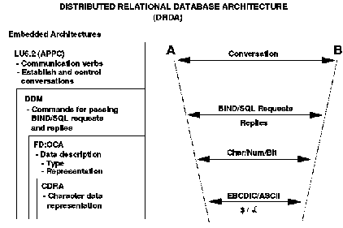

[Previous](3-3-13-1.md) | [Index](README.md) | [Next](3-3-13-3.md)

---

### 3\.3\.13\.2 Distributed Relational Database Architecture

Distributed Relational Database Architecture \(DRDA\) is the architecture provided by IBM that meets the needs of applications requiring access to distributed relational data\.

DRDA provides for connectivity between application programs and distributed relational database systems by:

- Describing information flows between participants\.
- Describing responsibilities of the participants and usage of the information flows\.
- Providing the formats and protocols required for distributed database management\.

DRDA does not provide an API with which to do this, however\. DRDA is transparent for the application program that continues to use SQL statements to initiate any database requests\. DRDA in the DBMS then uses the LU 6\.2 protocol for the communications between the systems concerned\.

Two levels of distribution have been defined for DBMSs\. **Remote Unit Of Work** With Remote Unit Of Work \(RUOW\), an application program executing in one system can access a single remote database using the SQL supported by that remote database management system \(DBMS\)\. The characteristics of RUOW are:

- One DBMS per SQL statement
- One DBMS per unit of work
- Allow multiple database requests per unit of work
- Application controls the "Commit" process

**Distributed Unit of Work** With Distributed Unit Of Work \(DUOW\), an application executing in one system can connect to multiple remote database management systems and direct SQL statements to them\. Characteristics of a Distributed Unit Of Work are:

- One DBMS per SQL statement
- Multiple DBMS per unit of work
- Allow multiple database requests per unit of work
- DBMSs support 2\-phase commit

If updates are made to multiple DBMSs, then a sync point management coordination function, with 2\-phase commit capabilities, is needed with the application; similar 2\-phase commit capabilities must be available within the serving DBMSs, and the communications connection must support 2\-phase commit conversations\. DRDA provides three types of functions and two protocols:

**Functions**

- Application Requester \(AR\) function

These functions enable SQL and program preparation services for applications\.

- Application Server \(AS\) function

The AS functions route the data requests to the database servers, and manage particular support requests for the AR functions\. For example, if the database from which the data is to come changed, then the server would manage the changed connection\.

- Database Server \(DS\) functions

The DS executes database requests from the AS\.

**Protocols**

- Application support protocol, which enables the database request conversation between the AR and SR\.
- Database support protocol, which provides the connection between the ASs and the DSs\.

The architectures used by DRDA to enable the database communication are shown in [Figure 73](86.png)\.

*Figure 73\. DRDA Architectures*

Briefly, architectural responsibility is as follows:

- DRDA allows the separation of an application from the relational data it will process\. It describes, through protocol models, the necessary interchanges between the application \(or more precisely, an agent on the application's behalf\) and a remote relational DBMS\. It also describes the contents of all data objects that flow between ARs and SRs on either commands or command replies, and it describes the correct flow of these commands and replies\.
- LU 6\.2, the architecture for Application Program\-to\-Program Communication \(APPC\), provides both ARs and SRs with basic conversation abilities\. DRDA relies on a subset of the full LU 6\.2 function for this, as well as support of security, accounting, and unit of work processing\.
- Distributed Data Management Architecture \(DDM\) is an architected data management interface used for data interchange among like or unlike systems\. It describes the model for DRDB processing between relational DBMSs, and it provides the commands, parameters, data objects, and messages needed to describe the interfaces between the various pieces of that model\.
- SNA Management Services Architecture \(MSA\) provides services to assist in the management of SNA networks\. DRDA uses this architecture in the generation and processing of generic alerts for problem determination\.
- Formatted Data Object Content Architecture \(FD:OCA\) supports exchanges and interchanges of field formatted information, both numeric and character\. DRDA uses a subset of this architecture to send both the data and its description, if required, so that it can be understood by the receiving DBMS\.
- Character Data Representation Architecture \(CDRA\) provides for the management of graphic character integrity where the code pages and character sets may be different at the two ends of the conversation\. It defines a consistent method for data conversion mapping to preserve this integrity\.

Subtopics:

- [3\.3\.13\.2\.1 Implementation in VM](<#3.3.13.2.1>)
- [3\.3\.13\.2\.2 Access Capabilities](<#3.3.13.2.2>)

---

[Previous](3-3-13-1.md) | [Index](README.md) | [Next](3-3-13-3.md)
