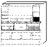

[Previous](3-3-12-3.md) | [Index](README.md) | [Next](3-3-13-1.md)

---

## 3\.3\.13 SQL and DRDA

<a id="HDRHSQL100"></a>

<a id="TBLTBLUNIQ19"></a>



```
                   Programs that access data across heterogeneous systems must have
                   the differences between the environments hidden from them.  For
                   example, ASCII and EBCDIC data translation should take place
                   transparently.  Communication links must be defined, data
                   integrity protected, and data formats known.

                   SQL is the adopted query language across the SAA platforms.  It
                   is the database interface defined in the SAA Common Programming
                   Interface (CPI).  SQL enables a programmer or user to retrieve,
                   update, delete, or insert data in relational database tables
                   uniformly across different platforms.  The platform database
                   management system determines the best way to perform what was
                   specified.  Here is a list of IBM's relational Database
                   Management System (DBMS) products forming the DB2 family:
```

IBM Database 2 \(DB2\) for MVS \(5685\-DB2\)

- DB2/VM and VSE \(5688\-103\), formerly SQL/DS
- DB2/400 \(5755\-AS2\), formerly SQL/400
- DB2/2 for OS/2 \- 5871\-AAA \- \(Announced March, 1993\)
- DB2/6000 \(5765\-172\), for AIX
- DB2 for HP\-UX and Solaris

These products are the DBMSs that provide the physical implementation of the databases and that interact with the operating system and network services\. Other products help develop applications and manage them in production; and still others offer interfaces specific to user needs, such as management and executive decision support\. We will describe some of the many products that could be used in a Client/Server implementation later in this section\. First, let's look at some Distributed Relational Database Management System concepts\.

Subtopics:

- [3\.3\.13\.1 IBM's Distributed Relational Database](3-3-13-1.md)
- [3\.3\.13\.2 Distributed Relational Database Architecture](3-3-13-2.md)
- [3\.3\.13\.3 Distributed Database Connection Services](3-3-13-3.md)
- [3\.3\.13\.4 Client Application Enabler Products](3-3-13-4.md)
- [3\.3\.13\.5 DRDA as an Open Standard](3-3-13-5.md)
- [3\.3\.13\.6 Publications](3-3-13-6.md)

---

[Previous](3-3-12-3.md) | [Index](README.md) | [Next](3-3-13-1.md)
