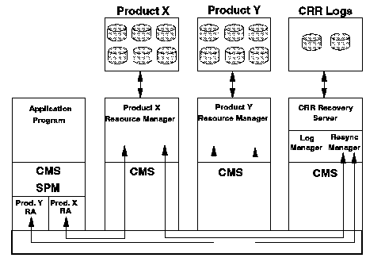

[Previous](3-3-14.md) | [Index](README.md) | [Next](3-3-14-2.md)

---

### 3\.3\.14\.1 Sync Point Managers and Resource Adapters

Coordinating and controlling the sync points for an application is

performed by the Sync Point Manager \(SPM\)\. The SPM is responsible for the commit and rollback of all resources that the application uses\. The SPM is the client part of the CRR code\. It resides in the user virtual machine that runs the requesting application, and is loaded automatically when a user IPLs CMS\. The SPM could be coordinating commits and rollbacks for multiple resources and therefore communicating with multiple resource managers\. The SPM interfaces with the client part of the resource manager code, which is called the resource adapter \(RA\)\. The RA is also loaded into the virtual machine running the application\. Therefore, when coordinating a commit for multiple resources, the SPM will communicate with multiple RAs\. The RAs will be communicating with the resource managers and logging information with the CRR recovery server\.

The relationship between the application, the application SPM and the CRR recovery server is shown in [Figure 76](90.png)\.

*Figure 76\. CRR, SPM, and RA Recovery Server*

The end result is that when an application issues a commit, a call is made to the SPM\. The SPM coordinates the updates with the RAs and ensures that all the updates are either committed or rolled back\. The SPM returns the result of the commit to the application, and therefore, the application sees the commit as a single atomic step\.

Each application has to provide its own RA\. For example, SFS provides its own RA\. An RA has to register itself and the resource with the SPM\. There are supplied CSL routines to allow a RA adapter to do this\.

---

[Previous](3-3-14.md) | [Index](README.md) | [Next](3-3-14-2.md)
