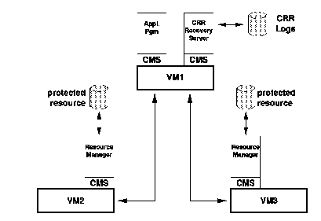
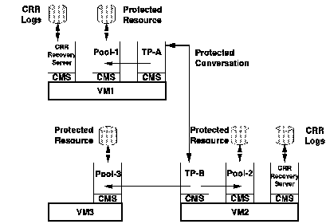

[Previous](3-3-13-6.md) | [Index](README.md) | [Next](3-3-14-1.md)

---

## 3\.3\.14 Coordinated Resource Recovery

<a id="HDRHCRR100"></a>

<a id="TBLTBLUNIQ20"></a>


```
                   In Section "Distributed System Services" in topic 2.3.3.2, the
                   distributed system services as, defined by the Open Blueprint,
                   were outlined.  One of these services was the transaction
                   manager.  The objective of this service is to allow an
                   application to securely coordinate updates to multiple
                   distributed resources.

                   Ensuring the integrity of an individual resource is the job of
                   that particular resource manager.  For example, the file
                   resource manager ensures that all updates to data are performed,
                   and if they cannot be performed, then the data will be returned
                   to its previous state and the requesting application informed.
```

This scenario is simple when there is only one resource to update\. If the resource is a distributed resource, then the client program is concerned only if the resource manager is suddenly unavailable, through either failure of the resource manager or the network\. In this case, if the client application is using one of the three interprocess communication models, this situation is reflected in a return code, and the application program can decide what action to take\.

However, if the application is updating multiple distributed resources that could be physically located on different systems in the network, then coordinating these updates becomes a challenge\. The classic example is of a banking system where a transfer is being made from one account to another\. The application must be certain that the money is debited from one account and credited to the other, and that both accounts are updated together\. If either of the transactions fails, them the bank accounts must be restored to their previous balances\.

Operations that work in this way are said to be atomic operations\. When multiple records have to be updated atomically, then these updates are termed a logical unit of work\. Reference points can be taken between these logical units of work, and these are termed synchronization points, or sync points for short\. When the updates within a logical unit of work are done, they are said to have been "committed\." If they cannot all be done, then they are rolled back\. The point to which they roll back is the last sync point and this is known as sync point recovery\. When the updated items do not belong to the same resource manager, one needs a so called "2\-phase commit" process\.

SNA defines this LU 6\.2 sync point architecture and the concept of sync point recovery\. SAA added a special service to the CPI, the Resource Recovery Interface \(RRI\), which allows the use of 2\-phase commitment\. Today, RRI is implemented by VM/ESA, IMS/ESA transaction manager, CICS/ESA and AIX\. VM's implementation is called Coordinated Resource Recovery \(CRR\), available since VM/ESA Release 1\.0\. In this section, when referring to either the LU 6\.2 sync point architecture or VM's implementation of it, the term CRR will be used\.

*Protected resources*: Not all resources can benefit from CRR\. The resource manager has to participate in CRR\. When a resource manager is participating in CRR the resource is said to be a "protected resource\." A good example of this in VM today, is the Shared File System \(SFS\), although not an open file system\. The SFS file manager, a file resource manager, participates in CRR so an application program can update data in two separate SFS file pools\. This is shown in [Figure 74](88.png)\. An application has not to worry about CRR, as long as it sends only updates to resource managers participating in CRR\. Remember that since CRR is a LU 6\.2 protocol, the application program communicates using CPI\-C or APPC/VM\.

<a id="FIGFCRR101"></a>



*Figure 74\. CRR Protected Resources*

*Protected conversations*: A more complex scenario would include two application programs updating multiple distributed resources\. An example is shown in [Figure 75](89.png)\. Here an application program, TP\-A, is updating a local file pool, POOL\-1, and requesting a distributed application program, TP\-B, to perform some other work which includes updating two other file pools, shown is POOL\-2 and POOL\-3\.

The conversation between TP\-A and TP\-B is protected by CRR and is said to be a "protected conversation\." TP\-A and TP\-B must be coded to use the appropriate CPI\-C calls in the conversation processing, to handle the commit/rollback status notifications\. An important point here is that protected conversations are supported only across a SNA connection, or inside a single VM system\. Resources can be protected across SNA, ISFC, and TSAF links\.

<a id="FIGFCRR102"></a>



*Figure 75\. CRR Protected Resources and Protected Conversations*

*CRR Recovery Server*: In both these figures, notice an additional service machine, the CRR recovery server\. The CRR recovery server itself is implemented on a SFS file pool server\. The CRR recovery server does not perform the sync point management itself\. The role of the CRR recovery server is to manage the CRR logs used by applications that take part in CRR\. The CRR recovery server is also responsible for resynchronizing the applications using CRR, should there be a network or system failure in the middle of an update\.

In [Figure 74](88.png), the CRR recovery server on system VM1 will log the protected resources being updated on VM2 and VM3\. In [Figure 75](89.png), the CRR recovery server on VM1 will log the protected resource Pool\-1, and the CRR recovery server on VM2 will log the protected resources Pool\-2 and Pool\-3\. The protected conversation is logged by both recovery servers\.

Subtopics:

- [3\.3\.14\.1 Sync Point Managers and Resource Adapters](3-3-14-1.md)
- [3\.3\.14\.2 Sync Point Processing](3-3-14-2.md)
- [3\.3\.14\.3 CRR Recovery Server](3-3-14-3.md)
- [3\.3\.14\.4 Publications](3-3-14-4.md)

---

[Previous](3-3-13-6.md) | [Index](README.md) | [Next](3-3-14-1.md)
