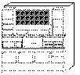

[Previous](3-3-15-3.md) | [Index](README.md) | [Next](3-3-16-1.md)

---

## 3\.3\.16 Development Tools and Languages

<a id="HDRHDVT100"></a>

<a id="TBLTBLUNIQ22"></a>



```
                   The area of Development Tools and Languages is one of the most
                   diverse areas that a book such as this can cover.  Many vendors
                   produce products of many forms to help information technology
                   departments produce applications that aid the running of the
                   business.  The area is so vast that we cannot hope to identify
                   any but a small percentage of products that could be used in a
                   Client/Server implementation including VM.
```

The information about vendor products has been obtained from vendor sources and IBM assumes no responsibility for its accuracy or completeness\.

The very nature of Client/Server computing is that the choice of development tools and languages on non\-VM/ESA platforms is not constrained\. The application developer on one platform can choose a language that will never run on another interoperating platform\. The services lower down in our Open Blueprint model depicted in [Figure 11 in](11.png) [topic 2\.3\.3](11.png), supply the implementation\-specific support that is needed\.

However, in the interests of being able to move from one platform to another, it is often appropriate to select languages that will enable easy relocation of the code from one platform to another\. This is easiest with languages that conform to a recognized standard, such as the ANSI language standards\.

The products that we will address fall into several groups:

- Third generation languages
- Single\- and cross\-platform development tools
- Application development enablers

Subtopics:

- [3\.3\.16\.1 Third Generation Languages](3-3-16-1.md)
- [3\.3\.16\.2 Development Tools](3-3-16-2.md)
- [3\.3\.16\.3 Application Development Enablers](3-3-16-3.md)

---

[Previous](3-3-15-3.md) | [Index](README.md) | [Next](3-3-16-1.md)
