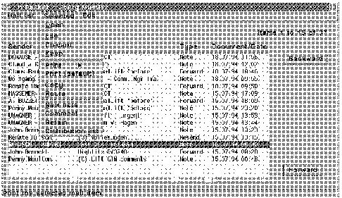

[Previous](3-3-16-3.md) | [Index](README.md) | [Next](3-3-17-1.md)

---

## 3\.3\.17 VisualLift for MVS, VM, and VSE

<a id="HDRHVSL100"></a>

<a id="TBLTBLUNIQ23"></a>


```
 |                  If you want to make your 3270 applications look brand new, have
 |                 a look at the program product called VisualLift for MVS, VM &
 |                 VSE (5648-109).  Without programming and without changing the
 |                 applications at the host, the end-users will see the 3270
 |                 applications as native workstation applications, including the
 |                 modern features, such as radio buttons, check boxes, and push
 |                 buttons.

 |                 The host application remains untouched, which means 3270 and
 |                 workstation users work with the same application, protecting
 |                 both your application and hardware investments.
```

The workstation users will be delighted to get a modern looking application, and will be more productive\. With VisualLift, host applications will be easier to learn and use, as inconsistencies in host application programs can be masked\. The ability to control the input, avoiding false data, further reduces host interactions\.

With the mainframe technology becoming even cheaper than ever since the introduction of new CMOS chips, a new workstation interface may be all that is necessary to enhance existing applications\. The end users will get a consistent environment on their workstation, improving their efficiency\.

[Figure 77](94.png) is an example of how good looking a 3270 application suddenly becomes\.

<a id="FIGFVISLFT"></a>



*Figure 77\. VisualLifted OfficeVision In\-Basket*

Subtopics:

- [3\.3\.17\.1 Advantages](3-3-17-1.md)
- [3\.3\.17\.2 VisualLift Implementation](3-3-17-2.md)
- [3\.3\.17\.3 Requirements for VisualLift](3-3-17-3.md)
- [3\.3\.17\.4 Publications](3-3-17-4.md)

---

[Previous](3-3-16-3.md) | [Index](README.md) | [Next](3-3-17-1.md)
