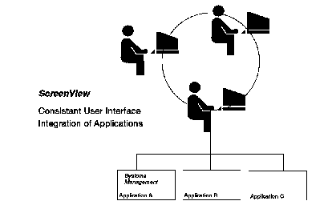

[Previous](3-3-18.md) | [Index](README.md) | [Next](3-3-18-2.md)

---

### 3\.3\.18\.1 ScreenView Overview

One of the problems facing an application designer is developing a consistent end\-user interface across a set of applications \([Figure 78](96.png)\)\. Normally, the functional part of the code becomes incorporated in the graphics, text, and commands part of the application, thus making it time consuming to maintain, and difficult to adapt to new and evolving standards\.

ScreenView is designed to solve this problem\.

*Figure 78\. ScreenView Application Integration*

*SystemView and ScreenView*: As we saw in Section ["SystemView" in](3-3-6.md) [topic 3\.3\.6](3-3-6.md), the SystemView product defines an end\-use dimension \(EUD\), that is part of other dimensions; such as application and data\. For an application to be EUD compliant, it must be based on a programmable workstation, be object oriented, and be consistent\. Further, the EUD must separate the function logic with the presentation logic, and its object oriented routines must map easily to the user interface\.

ScreenView supports these concepts in the following ways:

- User interfaces of a ScreenView application reside on a programmable workstation\.
- ScreenView is consistent; it provides a graphical interface for all the SystemView products\.
- ScreenView is CUA compliant\.
- ScreenView forces separation of function logic from presentation logic of an application\. ScreenView uses a declarative language that permits this\. ScreenView allows the end\-user interface to be updated as new technologies change the look of the end\-user interface\.

ScreenView applications can also share data with other ScreenView applications using a simple drag\-and\-drop approach on the ScreenView end\-user interface\.

---

[Previous](3-3-18.md) | [Index](README.md) | [Next](3-3-18-2.md)
