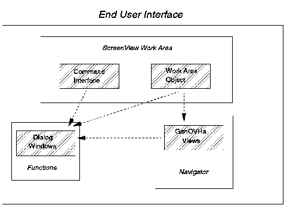

[Previous](3-3-18-1.md) | [Index](README.md) | [Next](3-3-18-3.md)

---

### 3\.3\.18\.2 ScreenView Application Details

A ScreenView application is designed around three interaction levels which are the main components of the end\-user interaction \([Figure 79](97.png)\):

- A normal ScreenView application appears as an object, or icon, in the work area object\.
- When a user opens up this object, it interacts with the navigator\.
- As the user determines what action is requested, ScreenView directs the user to the application's functions\.

The next sections provide details on each of these interaction levels\.

*Figure 79\. ScreenView Application Main Components*

Subtopics:

- [3\.3\.18\.2\.1 ScreenView Work Area](<#3.3.18.2.1>)
- [3\.3\.18\.2\.2 ScreenView Application Navigator](<#3.3.18.2.2>)
- [3\.3\.18\.2\.3 ScreenView Function](<#3.3.18.2.3>)

---

[Previous](3-3-18-1.md) | [Index](README.md) | [Next](3-3-18-3.md)
