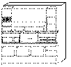

[Previous](3-3-17-4.md) | [Index](README.md) | [Next](3-3-18-1.md)

---

## 3\.3\.18 ScreenView

<a id="HDRHSCV100"></a>

<a id="TBLTBLUNIQ24"></a>



```
                   ScreenView is an orderable feature of the VM/ESA system used to
                   develop and run a consistent set of workstation applications
                   that can preform system management tasks in the SystemView
                   environment, or be used to create other applications.

                   In the next sections, you will become acquainted with the
                   various ScreenView functions.
```

Subtopics:

- [3\.3\.18\.1 ScreenView Overview](3-3-18-1.md)
- [3\.3\.18\.2 ScreenView Application Details](3-3-18-2.md)
- [3\.3\.18\.3 Sample Declaratives](3-3-18-3.md)
- [3\.3\.18\.4 Publications](3-3-18-4.md)

---

[Previous](3-3-17-4.md) | [Index](README.md) | [Next](3-3-18-1.md)
