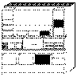
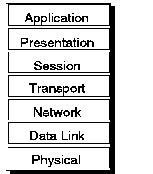

[Previous](3-3-1-8.md) | [Index](README.md) | [Next](3-3-2-1.md)

---

## 3\.3\.2 Open Systems Interconnection

<a id="HDRHOSI100"></a>

<a id="TBLTBLUNIQ9"></a>



```
                   Open Systems Interconnection (OSI) is a set of evolving
                   standards, preferably referred to for multivendor
                   interoperability.  As OSI is a worldwide requirement, the
                   International Organization for Standardization (ISO) accepted
                   ownership regarding standards for OSI to give it the appropriate
                   base for discussion.

                   ISO's framework for the development of new standards is the
                   accepted OSI Reference Model for communication, also known as
                   the Seven-Layer Model.
```

It provides the base for the development of Open Systems interchange by segmenting communication functions into seven layers\. This approach has been adopted by all vendors and organizations working in this area of information processing\. For example, IBM's Open Blueprint defines similar functions in its layers\. See [Chapter 5, "The Open Blueprint" in topic 2\.3](2-3.md) for an overview of the Open Blueprint\.

<a id="FIGOSIMODE"></a>



*Figure 43\. OSI Seven\-Layer Model*

Subtopics:

- [3\.3\.2\.1 Functions and Protocols](3-3-2-1.md)
- [3\.3\.2\.2 VM Implementation of OSI](3-3-2-2.md)
- [3\.3\.2\.3 Publications](3-3-2-3.md)

---

[Previous](3-3-1-8.md) | [Index](README.md) | [Next](3-3-2-1.md)
