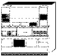

[Previous](3-3-2-3.md) | [Index](README.md) | [Next](3-3-3-1.md)

---

## 3\.3\.3 TCP/IP

<a id="HDRHTCP100"></a>

<a id="TBLTBLUNIQ10"></a>



```
                   One of the most widespread communications protocols is the
                   Transmission Control Protocol/Internet Protocol (TCP/IP), also
                   called the TCP/IP protocol suite.  It is a generic term for a
                   set of protocols such as TCP (Transmission Control Protocol) and
                   IP (Internet Protocol), and a set of applications and
                   application protocols such as a remote logon facility (TELNET),
                   file transfer (FTP), remote execution (REXEC), and others.
                   TCP/IP is suitable for both LAN and WAN operation.  It has
                   become the industry standard for the UNIX environment.
```

The first design goal of TCP/IP was to build an interconnection of networks that provides universal communication services: an Internetwork \(or Internet\)\. A common, universal interface was needed to hide the underlying architecture of the physical network from the user applications\.

To be able to interconnect two networks, we need a computer that is attached to both networks and that can forward packets of data from one network to the other, called the internet gateway or gateway\. This gateway is a normal host in the network\. From the user's view the gateway is transparent, the user sees just one large internetwork \(the term used for an Internet network\)\.

To be able to identify a host on the network, each host is assigned an address, the IP address, which is unique throughout the internet\.

Data is sent from host to host in the internetwork in packets known as datagrams\. A datagram is a manageable piece of data \(or all the data\) with control information added, which is sent as a packet over the network by IP\.

In our model, shown in [Figure 23 in topic 3\.1\.1\.2](23.png), TCP/IP is in the Networking Services area of the Open Blueprint model under the Common Transport Semantics area, Standard TCP/IP applications are found in other blocks higher in the model\.

We will begin this chapter with a discussion of internetworking and then refer to various other blocks in the model, detailing the functions and applications provided by the product and implemented in VM\.

While reading the remainder of this chapter, you probably will encounter terms similar to those used in DCE\. For a discussion about how TCP/IP relates to DCE and to OpenEdition VM, refer to ["TCP/IP and DCE](3-3-3-3.md) [Terminology" in topic 3\.3\.3\.3](3-3-3-3.md)\.

Subtopics:

- [3\.3\.3\.1 Internetworking](3-3-3-1.md)
- [3\.3\.3\.2 TCP/IP Application Protocols and APIs](3-3-3-2.md)
- [3\.3\.3\.3 TCP/IP and DCE Terminology](3-3-3-3.md)
- [3\.3\.3\.4 Publications](3-3-3-4.md)

---

[Previous](3-3-2-3.md) | [Index](README.md) | [Next](3-3-3-1.md)
