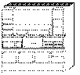

[Previous](3-3-7-3.md) | [Index](README.md) | [Next](3-3-8-1.md)

---

## 3\.3\.8 Host Management Facilities/VM

<a id="HDRHHMF100"></a>

<a id="TBLTBLUNIQ14"></a>



```
                   SystemView Host Management Facilities/VM (HMF/VM, 5684-157),
                   initially developed for IBM internal use, is an integrated set
                   of VM services that have received wide use and acceptance within
                   the IBM Corporation.  These VM services were designed to make
                   systems management for VM easier.  HMF services can reduce the
                   cost of managing VM systems by allowing system programmers and
                   system support people to do more work in less time.
```

HMF provides services for actively, automatically monitoring and controlling systems, subsystems, and applications\. System activities can be scheduled and synchronized by HMF\. HMF also provides communication services\. Part of HMF is a performance management facility that provides automation and consolidations of performance data collection on VM systems\.

Host Management Facilities/VM conforms to the SystemView structure, which is part of the SystemView strategy\. SystemView groups system management tasks into six management areas called "disciplines\." HMF provides function across the performance, operations, and problem management disciplines\.

Host Management Facilities normally run on each VM system in the network; however, HMF offers an optional workstation component that provides an enhanced user interface over the 3270 interface\. HMF offers a command interface and a panel interface to manage systems\. Full product function is available only with the host component\.

HMF can be used to manage multiple systems from a single system\.

Subtopics:

- [3\.3\.8\.1 Host Management Facilities/VM Functions](3-3-8-1.md)
- [3\.3\.8\.2 CPI Communications](3-3-8-2.md)
- [3\.3\.8\.3 Publications](3-3-8-3.md)

---

[Previous](3-3-7-3.md) | [Index](README.md) | [Next](3-3-8-1.md)
