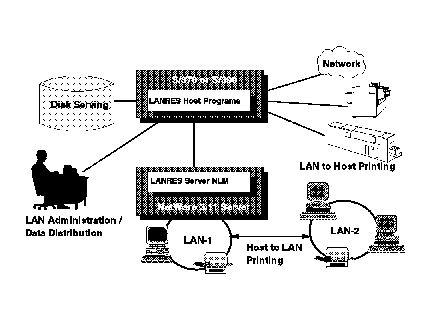

[Previous](3-3-9-1.md) | [Index](README.md) | [Next](3-3-9-3.md)

---

### 3\.3\.9\.2 LANRES Functions

There are four key functions that LANRES provides: disk serving, print serving, administration, and data distribution, as shown in [Figure 62](71.png)\.

*Figure 62\. LANRES Functions*

Subtopics:

- [3\.3\.9\.2\.1 Disk Serving](<#3.3.9.2.1>)
- [3\.3\.9\.2\.2 Print Serving](<#3.3.9.2.2>)
- [3\.3\.9\.2\.3 Administration](<#3.3.9.2.3>)
- [3\.3\.9\.2\.4 Data Distribution](<#3.3.9.2.4>)

---

[Previous](3-3-9-1.md) | [Index](README.md) | [Next](3-3-9-3.md)
