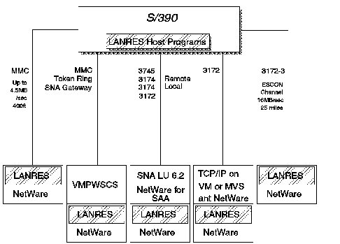

[Previous](3-3-9-2.md) | [Index](README.md) | [Next](3-3-9-4.md)

---

### 3\.3\.9\.3 Connectivity Options

LANRES has several connectivity options:

- Channel Attached Server
- SNA LU6\.2 Connection
- TCP/IP Connection

[Figure 67](76.png) gives an overview of these connections\.

**Channel Attached Server**

The following are the supported channel attachments for the NetWare server to the host:

- Micro Channel to Mainframe \(MMC\) connection

**Note:** Effective November 16, 1994 PWSCS is withdrawn from marketing\.

- The 3172\-3 with an ESCON Adapter
- The 3172\-3 with a parallel channel adapter

Using chained ESCON directors, the NetWare server can be up to 43 kilometers \(28 miles\) from the host\.

LANRES/VM R3 also includes new 3172\-3 features support, including the Pentium processor, Auto LANStreamer adapter, and EtherStreamer adapter\.

**SNA LU 6\.2 Connection**

SNA LU 6\.2 connectivity is probably the most flexible method of connecting a NetWare server to the host\. The NetWare LAN would be on a token\-ring LAN, which in turn could be connected to:

- 3745 attached to VTAM on the host\.
- Local SNA 3174 attached to VTAM on the host\.
- Remote 3174 linked to a 3745 which is in turn attached to the host\.
- 3172 link to VTAM running on the host\. Here, the 3172 can be used as both a SNA and TCP/IP gateway at the same time\.

SNA LU 6\.2 connection requires the NetWare for SAA 1\.2 NLM to be running on the NetWare server\.

LANRES/VM R3 introduces the NetWare for SAA channel driver, which provides a shared, common gateway for LANRES and NetWare for SAA to communicate with the host\. This support is provided by 3172 or MMC connection and supports LU\-2 or LU 6\.2 protocols\. Since this support has also been added to LANRES in MVS and OS/400, simultaneous communication is now possible with a VM, MVS, or OS/400 host from a single NetWare server\.

**TCP/IP connection**

This connection is usually achieved by having a 3172 channel attached to the host with the NetWare server being connected to the 3172 through either a token ring or Ethernet\. In this case, the TCP/IP NLM would be loaded into the NetWare server, and TCP/IP would be installed on VM\.

*Figure 67\. LANRES Connectivity Options*

---

[Previous](3-3-9-2.md) | [Index](README.md) | [Next](3-3-9-4.md)
