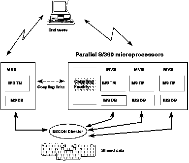

[Previous](2-1.md) | [Index](README.md) | [Next](2-1-2.md)

---

### 2.1.1 Sysplex Support and N-Way Data Sharing

An MVS Sysplex is a set of loosely coupled MVS systems whose objective is to present a single system image to the end user. Here, the end user could be a terminal user, a client program, or a submitter of a batch job. With a sysplex approach customers can: Have the required CPU power through multiple CMOS microprocessors, with their inherent cost benefits Avoid capacity limits of a single processor Grow incrementally (and hence reduce costs) to meet increased capacity requirements Experience very high availability Processors can be added or removed dynamically Software maintenance can be applied online (on one processor at a time) The loss of one component only proportionately reduces the system capacity. The workload can be redistributed across the remaining components.* Use ES/9000 processors in a sysplex, so allowing their full value to be realized.

*Parallel* *Transaction* *Server* *(PTS)*. A key component of a parallel sysplex is the *Coupling* *Facility* *(CF)*, which provides storage and function to allow resources to be efficiently shared by all the MVS systems. IMS 5.1 is the first IMS release designed to exploit the parallelism of a PTS system. In this release, IMS databases can be shared by all the IMS systems (transaction processing or batch), as shown diagrammatically in [Figure 1](1.png).

Figure 1. Parallel Transaction Server

This IMS facility is called *n-way* *data* *sharing*, and is a natural extension of block level data sharing (BLDS). BLDS was limited to a maximum of two MVS systems, whereas n-way data sharing can accommodate a maximum of 32 sharing subsystems. *IMS* *Resource* *Lock* *Manager* *(IRLM)*, designed to work in conjunction with the CF. Each IMS subsystem has its own IRLM. Unlike the previous two-way BLDS, however, the new IRLMs do not communicate directly with each other through VTAM; instead they maintain control information in the CF. This arrangement simplifies IRLM implementation and enables consistently high locking performance regardless of the number of sharing subsystems. Each IMS database manager maintains its own local buffer pool. When a buffer in one system is updated, that same data may sometimes be present in another IMS system's buffer pool (because that was where it had previously been processed). In that case, the updating IMS system notifies all systems that also have this data in their pools that their copies are no longer valid. This process is called *buffer* *invalidation*, and, although initiated by the updating IMS, it is the CF that (a) recognizes which systems have the data and (b) directly flags the relevant buffers as invalid. (Buffer invalidation is not necessary for Fast Path DEDBs.) The other major component of the IMS n-way data sharing facility is Database Recovery Control (DBRC). Customers should already be using DBRC at the Share Control Level to reap the benefits of system managed database integrity, even in a nonsharing environment. All shared databases must be registered with DBRC. DBRC then authorizes each shared access, tracks the multiple logs being produced on the various IMS systems, and should be used to generate the appropriate recovery jobs when needed.

---

[Previous](2-1.md) | [Index](README.md) | [Next](2-1-2.md)
