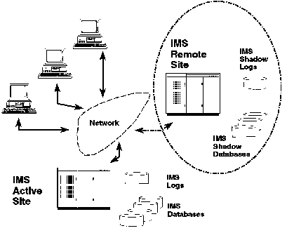

[Previous](2-3.md) | [Index](README.md) | [Next](2-3-2.md)

---

### 2.3.1 Remote Site Recovery Feature

The RSR feature of IMS 5.1 provides remote recovery for IMS DB full function databases, IMS Fast Path DEDBs, and the IMS TM message queues. There are no distance limitations with IMS RSR. The success of many companies depends on the availability of their computer services. Indeed, for some companies, their very survival depends on their computer services being almost permanently available. The computer service must remain, even when a computer center itself suffers an extended outage. A typical RSR configuration is depicted in [Figure 2](2.png).

<a id="4302RS1"></a>



Figure 2. Remote Site Recovery

```text
    ________________________________________________________________________ 
   |                                                                                  |
   |                                                                                  |
   |                                                                                  |
   |                                                                                  |
```

RSR is the ability to quickly reinstate the critical workload at a remote computing center after a loss of service at the active site. The remote site must be far enough away not to be affected by the outage. Nothing is shared between the two systems; only a communications line is needed to transmit log data from one site to the other. The remote site, also referred to as the tracking site, remains ready to take over the work of the active site at any time. This transfer of service can be planned or unplanned. A takeover involves shutting down the tracking subsystem, performing forward recovery for those databases that require it, and then starting the remote IMS subsystem as the new active subsystem to run the critical production work. The key function used by RSR to achieve this objective is the sending of log data to the tracking site as each log buffer is filled. The database changes arrive at the tracking site almost as soon as they occur at the active site. Some recovery-related information (DBRC data) is added to the log to ensure that the data transmitted to the tracking site is sufficient for full recovery with integrity. The databases that are to be tracked must be registered in DBRC. Normal IMS processing is not impacted by the RSR implementation, and the recovery process does not need application program changes. RSR uses standard, though enhanced, recovery procedures. A particularly important point regarding data integrity is that RSR always provides database consistency at the remote site. Only complete sets of updates (units of recovery) are applied to the remote databases. Those customers who are using XRF can also use RSR. The two techniques complement each other and remain consistent with a continuous availability strategy. It is important to recognize that for customers wanting remote site contingency, RSR is just one component of the total solution. It covers the application DL/1 data, but not program libraries, sequential files, and other types of database.

---

[Previous](2-3.md) | [Index](README.md) | [Next](2-3-2.md)
