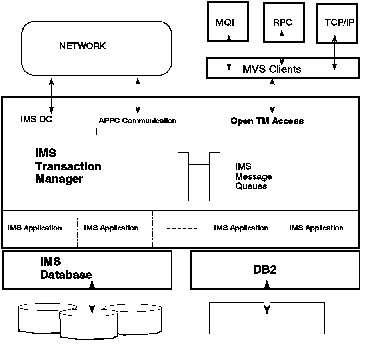

[Previous](2-4.md) | [Index](README.md) | [Next](2-4-2.md)

---

### 2\.4\.1 Open Transaction Manager Access

OTMA provides a client/server protocol between IMS applications and other MVS programs\. The MVS programs are typically intermediate servers to end users on workstations using communications facilities such as TCP/IP and communication models such as APPC, Remote Procedure Call, or Messaging and Queueing\. The main objective of OTMA is to simplify the communication between the MVS programs \(IMS OTMA clients\) and the IMS server for transaction processing\. OTMA is a new interprocess communication facility within an MVS environment\.

OTMA is implemented in an MVS Sysplex environment and is based on the MVS XCF, a way of exchanging data between two processes at high speed, introduced in MVS/ESA Version 4\. IMS communicates with these MVS applications over an XCF group\. The members of an XCF group are the MVS application programs \(the OTMA clients\) and IMS itself\.

OTMA runs only in IMS TM or DCCTL environments and not in a DBCTL environment\. Because existing IMS applications can run without modification and be called from any OTMA client, there is more flexibility in the choice of routes to access IMS applications\.

[Figure 3](3.png) illustrates an IMS system with OTMA\.

Several other IBM products will exploit OTMA at the earliest possible opportunity:

- MQSeries for MVS/ESA

With OTMA, existing IMS applications will be available in a network using MQI as the communications interface\. The MVS MQ queuing will be bypassed, and only IMS queuing will occur\.

- IMS TCP/IP

This MVS product allows workstations to enter transactions by means of TCP/IP into IMS\. There are plans for a subsequent release to enable TCP/IP sockets to interface with existing IMS applications using OTMA\.

- DCE Application Server/IMS \(AS/IMS\)

RPC calls can access existing IMS applications with AS/IMS, using ISC as the communication interface\.

A new version of AS/IMS will use OTMA instead of ISC to take advantage of the simpler interface and improved performance\.

The OTMA interface is externally documented, enabling user or vendor applications to be created according to the market demand\. But note that the design and coding of an OTMA client require skills that are definitely not within the scope of a typical COBOL application programmer\.

*Figure 3\. Open IMS*

OTMA offers the following advantages:

- High performance access to IMS using the MVS XCF application programming interface \(API\)
- Existing applications run without change
- No system definition dependencies
- Freedom from networking architecture
- Flow\-control and transaction attributes can be dynamically bound to the transaction
- Full\-duplex processing\.

OTMA uses a Tpipe instead of an LTERM\. A Tpipe is a named IMS process management resource that the OTMA client must specify when submitting a transaction to IMS\. It is a logical structure that represents an anchor point for client transaction input and output \. The Tpipe name is unique within a client structure in IMS\.

This OTMA protocol treats transactions as data objects that have attributes independent of application, session, or transport layer considerations and encapsulates all transaction data within the OTMA protocol messages\. It also tries to keep a minimum amount of information in the IMS control blocks by including the information in the message itself\.

OTMA supports non\-response\-mode and response\-mode transactions, including IMS conversational and Fast Path transactions\.

As for APPC/IMS, OTMA does not support MFS\.

---

[Previous](2-4.md) | [Index](README.md) | [Next](2-4-2.md)
